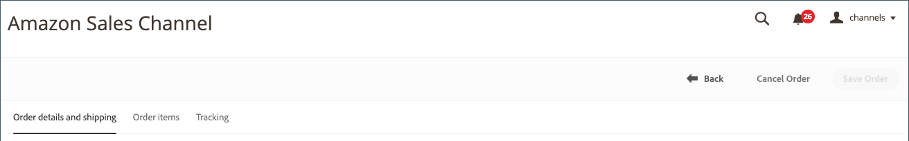
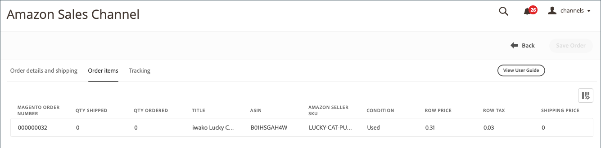

# Amazon-ordergegevens

## Amazon-ordergegevens weergeven

1. Klikken **[!UICONTROL View Store]** op de winkelkaart.

1. In de _[!UICONTROL Recent Orders]_klikt u op een bestelnummer.

   De _[!UICONTROL Amazon Order Details]_pagina wordt geopend.

>[!NOTE]
>
>Als uw bestelling is geïmporteerd in uw [Orderinstellingen](./order-settings.md) en de volgorde [vervuld door Amazon (FBA)](./fulfilled-by.md)In de bestelgegevens ziet u mogelijk dummygegevens voor bepaalde velden. Amazon verzendt de volgende gegevens voor FBA-orders niet.
>
> - `AddressType`
> - `AddressLine1`
> - `AddressLine2`
> - `AddressLine3`
> - `BuyerName`
> - `Phone`
> - `PurchaseOrderNumber`
> - `RecipientName`
> - `CustomizedURL`
> - `GiftMessageText`

### Tabblad Bestelling en verzendgegevens

De _[!UICONTROL Order and Shipping Details]_bevat gedetailleerde ordergegevens, zoals ontvangen van Amazon.

>[!IMPORTANT]
>
>Amazon accepteert niet-standaard adresgegevens die niet kunnen worden geïmporteerd in Amazon-verkoopkanalen, waardoor de land-/landcodes voor sommige bestellingen niet correct kunnen worden bijgewerkt. Om adresfouten te corrigeren, zijn de volgende velden bewerkbaar in de volgordedetails:
>
>- `Shipping address 1`
>- `Shipping address 2`
>- `Shipping address 3`
>- `Shipping city`
>- `Shipping region`
>- `Shipping postal code`
>- `Shipping country`

>
>Vergeet niet op **Volgorde opslaan** nadat u bewerkingen hebt uitgevoerd.

### Items bestellen, tabblad

De _[!UICONTROL Order Items]_worden alle items weergegeven die aan de Amazon-order zijn gekoppeld, zoals deze van Amazon zijn ontvangen.

### Tabblad Tekstspatiëring

De _[!UICONTROL Tracking]_wordt informatie over het bijhouden van de Amazon-volgorde weergegeven.

