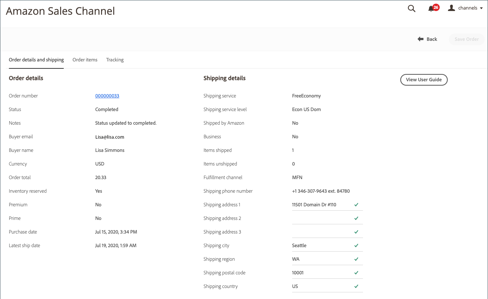

# Amazon-ordergegevens

## Amazon-ordergegevens weergeven

1. Klik op **[!UICONTROL View Store]** op de winkelkaart.

1. Klik in de sectie _[!UICONTROL Recent Orders]_op een bestelnummer.

   De pagina _[!UICONTROL Amazon Order Details]_wordt geopend.

>[!NOTE]
>
>Als u bestelimport hebt ingeschakeld in uw [Order Settings](./order-settings.md) en de volgorde is [vervuld door Amazon (FBA)](./fulfilled-by.md), ziet u mogelijk dummygegevens voor sommige velden in de orderdetails. Amazon verzendt de volgende gegevens voor FBA-orders niet.
>
> - `AddressType`
> - `AddressLine1`
> - `AddressLine2`
> - `AddressLine3`
> - `BuyerName`
> - `Phone`
> - `PurchaseOrderNumber`
> - `RecipientName`
> - `CustomizedURL`
> - `GiftMessageText`

### Tabblad Bestelling en verzendgegevens

Op het tabblad _[!UICONTROL Order and Shipping Details]_staan gedetailleerde ordergegevens die u van Amazon hebt ontvangen.

>[!IMPORTANT]
>
>Amazon accepteert niet-standaard adresgegevens die niet kunnen worden geïmporteerd in Amazon-verkoopkanalen, waardoor de land-/landcodes voor sommige bestellingen niet correct kunnen worden bijgewerkt. Om adresfouten te corrigeren, zijn de volgende velden bewerkbaar in de volgordedetails:
>
>- `Shipping address 1`
>- `Shipping address 2`
>- `Shipping address 3`
>- `Shipping city`
>- `Shipping region`
>- `Shipping postal code`
>- `Shipping country`

>
>Vergeet niet om **Volgorde** te klikken na het aanbrengen van veranderingen.

### Items bestellen, tabblad

Op het tabblad _[!UICONTROL Order Items]_worden alle items weergegeven die zijn gekoppeld aan de Amazon-volgorde, zoals deze zijn ontvangen van Amazon.

### Tabblad Tekstspatiëring

Op het tabblad _[!UICONTROL Tracking]_wordt informatie over het bijhouden van de Amazon-volgorde weergegeven.

