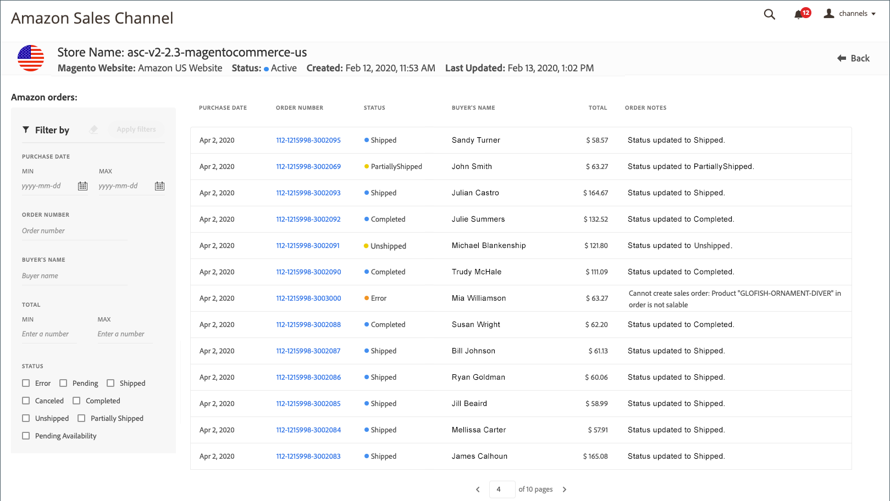
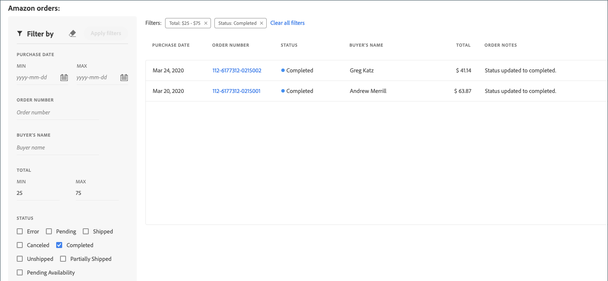

# Amazon-bestellingen weergeven

Er zijn twee manieren om uw Amazon-bestellingen weer te geven: _[!UICONTROL Recent Orders]_en_[!UICONTROL All Orders]_.

Beide opties tonen u basisordeinformatie, zoals ontvangen van Amazon, die omvat:

- Aankoopdatum
- Volgnummer
- Status
- Naam koper
- Eindtotaal
- Ordernotities

_[!UICONTROL All Orders]_de mening voegt het filtreren opties voor ordeonderzoeken toe.

>[!NOTE]
>
>Met uitzondering van de kolom _[!UICONTROL Order Notes]_wordt de tabel_[!UICONTROL Amazon orders]_ gevuld met ordergegevens die zijn ontvangen van Amazon. De kolom _Order Notes_ wordt door [!DNL Commerce] bijgewerkt als de ordeprocessen.

## Recente orders

U kunt uw meest recente bestellingen weergeven in de sectie _[!UICONTROL Recent Orders]_van het [opslagdashboard](./amazon-store-dashboard.md).

### Recente Amazon-bestellingen weergeven

1. Klik op **[!UICONTROL View Store]** op een winkelkaart.

1. Bekijk uw bestellingen in de sectie _[!UICONTROL Recent Orders]_.

1. Klik op het Amazon-ordernummer in de kolom _[!UICONTROL Order Number]_om de ordergegevens weer te geven.

   De pagina _[!UICONTROL Amazon Order Details]_voor de volgorde wordt geopend.

## Alle bestellingen weergeven

U kunt al uw Amazon-bestellingen weergeven op de pagina _[!UICONTROL Amazon orders]_(ook wel de weergave_[!UICONTROL All Orders]_ genoemd). De Amazon-tabel voor bestellingen is vergelijkbaar met de sectie _[!UICONTROL Recent Orders]_van het winkeldashboard, maar u kunt alle Amazon-bestellingen weergeven en uw lijst met bestellingen beperken met de volgende filteropties:

- [!UICONTROL Purchase Date (range)]
- [!UICONTROL Order Number]
- [!UICONTROL Buyer's Name]
- [!UICONTROL Total (range)]
- [!UICONTROL Status]

### Alle Amazon-bestellingen weergeven

1. Klik op **[!UICONTROL View Store]** op een winkelkaart.

1. Klik **[!UICONTROL All Orders]** in _[!UICONTROL Recent Orders]_sectie.

1. Als u de lijst of zoekopdracht naar een specifiek volgnummer wilt beperken, voert u de parameters **[!UICONTROL Filter by]** in en klikt u op **[!UICONTROL Apply filters]**.

1. Klik op het Amazon-ordernummer in de kolom _[!UICONTROL Order Number]_om de ordergegevens weer te geven.

   De pagina _[!UICONTROL Amazon Order Details]_voor de volgorde wordt geopend.

## Filters gebruiken

U kunt filters op uw ordelijst in _[!UICONTROL Filter by]_sectie toepassen. Maak uw selecties en klik **[!UICONTROL Apply filters]**. De toegepaste filters verschijnen boven het orderraster.

### Toegepaste filters wijzigen

- In de sectie _[!UICONTROL Filter by]_kunt u filters toevoegen of wijzigen. Klik **[!UICONTROL Apply filters]**om de ordelijst en de filteropties bij te werken die boven het orderraster worden weergegeven.

- U kunt filters één voor één verwijderen door op `x` voor het filter te klikken of allemaal tegelijk door op **[!UICONTROL Clear all filters]** te klikken. Als u een filter verwijdert, worden de volgordelijst en de filteropties bijgewerkt die boven het raster voor bestellingen worden weergegeven.

- Als uw ordelijst lang is, kunt u de pagineringscontroles onder het net gebruiken om meer orden te bekijken.

>[!TIP]
>
>Enkele tips voor de weergave Bestellingen:
>
>- Als u meerdere Amazon Store-integraties hebt, moet u de paginaweergave vernieuwen wanneer u overschakelt tussen de winkelweergaven om zowel de lijst met bestellingen als de pagineringsweergaven voor de huidige winkel bij te werken.
>- Bij het sorteren op kolom wordt de sortering alleen toegepast op de huidige lijstweergave. U kunt het beste uw lijst filteren en vervolgens de pagina die u bekijkt sorteren.
>- Afhankelijk van de breedte van het weergavevenster ziet u mogelijk overlappende tekst in de kolommen. Als u de kolommen voor de omloop van tekst wilt uitvouwen, verbreedt u de vensterweergave.
>- Wanneer het filtreren door _[!UICONTROL Total]_, filter door gehele aantallen. Als u een decimaal getal invoert, kunnen er fouten in de resultaten optreden.

### Standaardkolommen

| Kolom | Beschrijving |
|---|---|
| [!UICONTROL Filter by] | Alleen beschikbaar in de weergave _[!UICONTROL All Orders]_. Versmal de lijst met bestellingen op basis van:<ul><li>`Purchase Date (range)`</li><li>`Order Number`</li><li>`Buyer's Name`</li><li>`Total (range)`</li><li>`Status`</li></ul> |
| [!UICONTROL Purchase Date] | De datum van de aankoop, zoals ontvangen van Amazon. |
| [!UICONTROL Order Number] | Het ordernummer dat is gegenereerd door en ontvangen van Amazon. Klik op de koppeling als u het scherm Amazon Order Details wilt weergeven. |
| [!UICONTROL Status] | De status van de bestelling, zoals ontvangen door Amazon. Opties: `Error` / `Pending` / `Shipped` / `Canceled` / `Completed` / `Unshipped` / `PartiallyShipped` / `PendingAvailability` |
| [!UICONTROL Buyer's Name] | De naam van de persoon die de bestelling heeft geplaatst, zoals deze van Amazon is ontvangen. |
| [!UICONTROL Grand Total] | De totale valutawaarde van de bestelling, zoals ontvangen van Amazon. |
| [!UICONTROL Order Notes] | De meest recente handeling die is opgenomen voor de volgorde terwijl deze wordt verwerkt in [!DNL Commerce]. De informatie omvat, maar is niet beperkt tot, de fouten van de ordeinvoer en de updates van de ordeverwerking. **Opmerking**: Dit gebied wordt bijgewerkt door  [!DNL Commerce] als ordeprocessen. |
