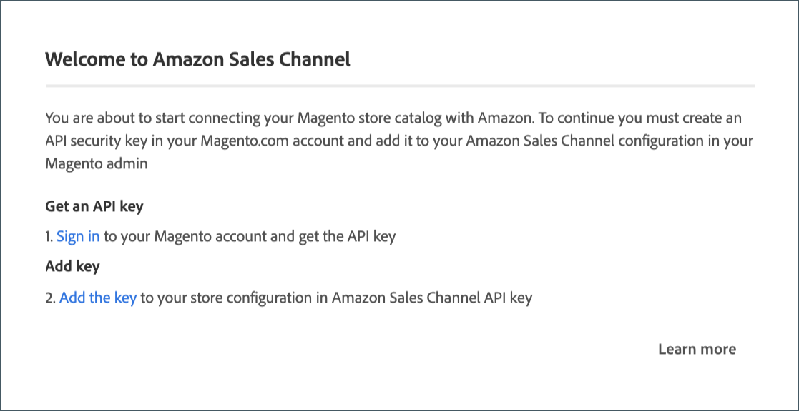

# De Amazon API-sleutel toevoegen of verifiëren

Bij toegang tot Amazon-verkoopkanaal [!DNL Commerce] controleert en valideert automatisch de Amazon API-sleutel die u in uw winkelconfiguratie hebt toegevoegd. Indien gevalideerd, kunt u verdergaan naar de volgende stap, [Opslagintegratie](./store-integration.md).

Als de Amazon API-sleutel ontbreekt, ongeldig of verlopen is, moet u de sleutel bijwerken. Er verschijnt een bericht waarin u wordt gevraagd een API-sleutel op te halen en deze toe te voegen aan de configuratie van het Amazon-verkoopkanaal.

## De Amazon API-sleutel ophalen en toevoegen wanneer hierom wordt gevraagd

De API-sleutel wordt telkens gevalideerd wanneer u uw Amazon-verkoopkanaal opent.

1. Aanmelden bij de [!DNL Commerce] Admin.

1. Op de _[!UICONTROL Admin]_zijbalk, ga naar **[!UICONTROL Marketing]**>_[!UICONTROL Channels]_ > **[!UICONTROL Amazon Sales Channel]**.

   Als u voor het eerst Amazon-verkoopkanaal opent of als uw API-sleutel moet worden bijgewerkt, wordt u door het proces gevraagd.

   {width="500"}

1. Klikken **[!UICONTROL Sign in]** om toegang te krijgen tot uw [!DNL Commerce] webaccount.

   De pagina Commerce-accounts wordt geopend in een nieuw browsertabblad.

   - Als u bent aangemeld bij uw [!DNL Commerce] de _[!UICONTROL API Portal]_van de_[!UICONTROL My Account]_ wordt automatisch weergegeven.

   - Als u niet bent aangemeld, wordt u gevraagd uw [!DNL Commerce] gebruikersnaam en wachtwoord voor de _[!UICONTROL API Portal]_wordt weergegeven.

   - Als u geen account hebt, gaat u naar [de [!DNL Commerce] accountpagina](https://account.magento.com/customer/account/login/){target="_blank"} en registeren. Deze account moet onderdeel zijn van uw bedrijf of bedrijf.

1. Indien nodig kunt u API-sleutels weergeven en genereren op de _[!UICONTROL API Portal]_in uw [!DNL Commerce] account.

   Als u een API-sleutel wilt maken, voert u een beschrijving in zoals `Amazon Sales Channel` en klik op **[!UICONTROL Add New]**. De nieuwe sleutel wordt geproduceerd en getoond met de naam die u inging. Klikken **[!UICONTROL Copy]** om de nieuwe sleutel te kopiëren.

   {width="500" zoomable="yes"}

1. Als de nieuwe sleutel is gegenereerd en gekopieerd, gaat u terug naar de _[!UICONTROL Amazon Sales Channel]_in de browser.

1. Op de _[!UICONTROL Welcome to Amazon Sales Channel]_pagina, klikt u op **[!UICONTROL Add the key]**.

   De browser sluit het verkoopkanaal van Amazon af en een pagina van de winkelconfiguratie opent de _[!UICONTROL Api Keys]_pagina in de [!DNL Commerce] Admin. U kunt deze pagina handmatig openen wanneer u naar **[!UICONTROL Stores]**>_[!UICONTROL Settings]_ > **[!UICONTROL Configuration]**, uitbreiden **[!UICONTROL Services]** in het linkerdeelvenster en kies **[!UICONTROL Magento Services]**.

1. Plak de gekopieerde sleutel voor **[!UICONTROL Production Api key]**.

1. Klikken **[!UICONTROL Save Config]**. Je kunt nu terugkeren naar het verkoopkanaal van Amazon.

   {width="600" zoomable="yes"}

1. Op de _[!UICONTROL Admin]_zijbalk, ga naar **[!UICONTROL Marketing]**>_[!UICONTROL Channels]_ > **[!UICONTROL Amazon Sales Channel]**.

   Amazon-triggers voor verkoopkanalen opnieuw openen [!DNL Commerce] Controleer en valideer de API-sleutel en zorg dat u kunt doorgaan.

   Als u wordt gevraagd om de sleutel opnieuw te verifiëren, herhaalt u dit _Toevoegen en verifiëren_ proces.

 [**Doorgaan met integratie opslaan**](./store-integration.md)
