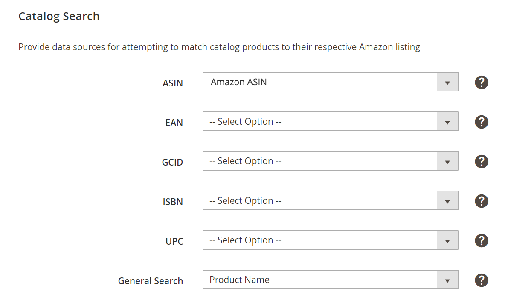

# Catalogus zoeken

_Catalogus zoeken_ Deze instellingen maken deel uit van de aanbiedingsinstellingen van je winkel. Lijstinstellingen zijn toegankelijk via de [opslagdashboard](./amazon-store-dashboard.md).

Met deze instellingen kunt u kenmerkovereenkomsten instellen die u helpen in aanmerking komende kenmerken toe te wijzen [!DNL Commerce] producten met Amazon-aanbiedingen. Als Amazon een kaart heeft toegewezen, activeert het acties met betrekking tot prijzen, hoeveelheden, overschrijvingen en volgorde en productsynchronisatie.

Als u deze toewijzingswaarden definieert, neemt de kans op exacte overeenkomsten toe, waardoor de noodzaak om productaanbiedingen handmatig af te stemmen, tot een minimum wordt beperkt. De kenmerken toevoegen als onderdeel van uw [Taken vooraf instellen](./amazon-pre-setup-tasks.md), Amazon verkoopkanaal heeft een groter potentieel om uw producten automatisch aan te passen tijdens het instappen en synchroniseert productgegevens tussen Amazon en [!DNL Commerce].

Als u alleen het Amazon ASIN-kenmerk maakt (zonder ASIN-waarden per product toe te voegen), kunt u [!DNL Commerce] producten komen mogelijk niet automatisch overeen met je Amazon-aanbiedingen. U kunt [handmatig toewijzen](./creating-assigning-catalog-products.md) uw producten. Handmatige overeenkomsten maken echter niet de gegevenselementen die nodig zijn voor het delen en synchroniseren van uw productgegevens.

>[!IMPORTANT]
>
>Als u handmatig een product aanpast en u een ASIN-, UPC- of ander gegevenselement voor het product wilt bijwerken, moet u de gegevens op twee plaatsen bijwerken. Werk het bij in uw [!DNL Commerce] catalogus en in je Amazon-aanbieding in je [!DNL Amazon Seller Central] account.

Het is aan te raden deze kenmerken en waarden indien beschikbaar in kaart te brengen. Het voltooien van deze toewijzing is niet vereist, maar is gunstig voor productmatching en is vereist voor een correcte synchronisatie van catalogi tussen Amazon en [!DNL Commerce].

Als u kenmerken wilt toevoegen, raadpleegt u [Productkenmerken maken voor Amazon Matching](./ob-creating-magento-attributes.md).

## Configureren [!UICONTROL Catalog Search] instellingen

1. Klikken **[!UICONTROL Listing Settings]** op het opslagdashboard.

1. Breid uit _[!UICONTROL Catalog Search]_sectie.

1. Voor **[!UICONTROL ASIN]**, kiest u het productkenmerk dat u voor de Amazon ASIN-waarde hebt gemaakt.

   Een ASIN ([!DNL Amazon Standard Identification Number]) is een uniek blok van tien letters en/of cijfers dat items identificeert. Voor boeken, is ASIN het zelfde als het aantal ISBN, maar voor alle andere producten wordt een nieuwe ASIN gecreeerd wanneer het punt aan hun catalogus wordt geupload. Je vindt een artikel in ASIN op de productdetailpagina op Amazon, samen met meer informatie over het object.

1. Voor **[!UICONTROL EAN]**, kiest u het productkenmerk dat u voor de Amazon EAN-waarde hebt gemaakt.

   Het Europese artikelnummer (EAN) is een norm voor streepjescodes, een productidentificatiecode van twaalf of dertien cijfers. Elk EAN identificeert het product, de fabrikant en zijn kenmerken op unieke wijze; Doorgaans wordt het EAN als streepjescode afgedrukt op een etiket of verpakking van het product. Amazon heeft EAN-codes nodig om de kwaliteit van de zoekresultaten en de kwaliteit van de catalogus te verbeteren. U kunt EANs van de fabrikant verkrijgen.

1. Voor **[!UICONTROL GCID]**, kiest u het productkenmerk dat u voor de Amazon GCIN-waarde hebt gemaakt.

   De globale catalogus-id (GCID) is een id voor producten die geen UPC-code of ISBN hebben. Met het Amazon-merkregister kunt u zich registreren als merkhouder en een unieke id voor producten maken.

1. Voor **[!UICONTROL ISBN]**, kiest u het productkenmerk dat u voor de Amazon ISBN-waarde hebt gemaakt.

   Het ISBN (International Standard Book Number) is een unieke streepjescode ter identificatie van een handelsportefeuille. Elke ISBN-code identificeert een boek op unieke wijze. Een ISBN heeft of tien of 13 cijfers. Alle ISBN die na 1 januari 2007 worden toegewezen hebben 13 cijfers.

1. Voor **[!UICONTROL UPC]**, kiest u het productkenmerk dat u voor de Amazon UPC-waarde hebt gemaakt.

   De Universal Product Code (UPC) is een streepjescode van 12 cijfers die veel wordt gebruikt voor detailverpakkingen in de Verenigde Staten.

1. Voor **[!UICONTROL General Search]**, kiest u het productkenmerk dat u wilt gebruiken voor een algemene zoekovereenkomst.

   Dit kenmerk is een kenmerk dat u kunt selecteren [!DNL Commerce] producten naar de desbetreffende Amazon-lijst. Bij de algemene zoekopdracht worden trefwoordzoekopdrachten uit de catalogus gebruikt. Daarom wordt aanbevolen om een [!DNL Commerce] attribuut dat relevante sleutelwoorden, zoals product SKU of productnaam draagt. Algemene zoekopdracht kan veel mogelijke overeenkomsten opleveren. In dergelijke gevallen kunt u de juiste Amazon-aanbieding selecteren uit de mogelijke overeenkomsten. Een algemene selectie voor dit veld is `Product Name`.

1. Klik op **[!UICONTROL Save listing settings]**.

| Veld | Beschrijving |
|--- |--- |
| [!UICONTROL ASIN] | Een uniek blok van 10 letters en/of cijfers dat items identificeert.  ASIN staat voor de [!DNL Amazon Standard Identification Number]. Een ASIN is een uniek blok van 10 letters en/of getallen dat items identificeert. Voor boeken, is ASIN het zelfde als het aantal ISBN, maar voor alle andere producten wordt een nieuwe ASIN gecreeerd wanneer het punt aan hun catalogus wordt geupload. Je vindt een artikel in ASIN op de productdetailpagina op Amazon, samen met meer informatie over het object. |
| [!UICONTROL EAN (European Article Number)] | Een 12- of 13-cijferige productidentificatiecode. Het Europese artikelnummer (EAN) is een norm voor streepjescodes, een productidentificatiecode van twaalf of dertien cijfers. Elk EAN identificeert het product, de fabrikant en zijn kenmerken op unieke wijze; Doorgaans wordt het EAN als streepjescode afgedrukt op een etiket of verpakking van het product. Amazon heeft EAN-codes nodig om de kwaliteit van de zoekresultaten en de kwaliteit van de catalogus te verbeteren. U kunt EANs van de fabrikant verkrijgen. |
| [!UICONTROL GCID (Global Catalog Identifier)] | De globale catalogus-id (GCID) is een id voor producten die geen UPC-code of ISBN hebben. Met het Amazon-merkregister kunt u zich registreren als merkeigenaar en een unieke id maken voor producten die geen UPC of ISBN hebben. |
| [!UICONTROL ISBN (International Standard Book Number)] | Een unieke streepjescode voor een handelsportefeuille van 10 of 13 cijfers. Het ISBN (International Standard Book Number) is een unieke streepjescode ter identificatie van een handelsportefeuille. Elke ISBN-code identificeert een boek op unieke wijze. Een ISBN heeft of tien of 13 cijfers. Alle ISBN die na 1 januari 2007 worden toegewezen hebben 13 cijfers. |
| UPC (Universal Product Code) | Een streepjescode van 12 cijfers. De Universal Product Code (UPC) is een streepjescode van 12 cijfers die veel wordt gebruikt voor detailverpakkingen in de Verenigde Staten. |
| [!UICONTROL General Search] | Selecteer een kenmerk. Dit kenmerk is een kenmerk dat u kunt selecteren [!DNL Commerce] producten naar de desbetreffende Amazon-lijst. Bij de algemene zoekopdracht worden trefwoordzoekopdrachten uit de catalogus gebruikt. Daarom wordt aanbevolen om een [!DNL Commerce] attribuut dat relevante sleutelwoorden, zoals product SKU of productnaam draagt. Algemene zoekopdracht kan veel mogelijke overeenkomsten opleveren. In dergelijke gevallen kunt u de juiste Amazon-aanbieding selecteren uit de mogelijke overeenkomsten. Een algemene selectie voor dit veld is `Product Name`. |

**Snelle toegang** - [!UICONTROL Listing Settings] secties

- [[!UICONTROL Product Listing Actions]](./product-listing-actions.md)
- [[!UICONTROL Third Party Listings]](./third-party-listing-settings.md)
- [[!UICONTROL Listing Price]](./listing-price.md)
- [[!UICONTROL (B2B) Business Price]](./business-pricing.md)
- [[!UICONTROL Stock / Quantity]](./stock-quantity.md)
- [[!UICONTROL Fulfilled By]](./fulfilled-by.md)
- [[!UICONTROL Catalog Search]](./catalog-search.md)
- [[!UICONTROL Product Listing Condition]](./product-listing-condition.md)
