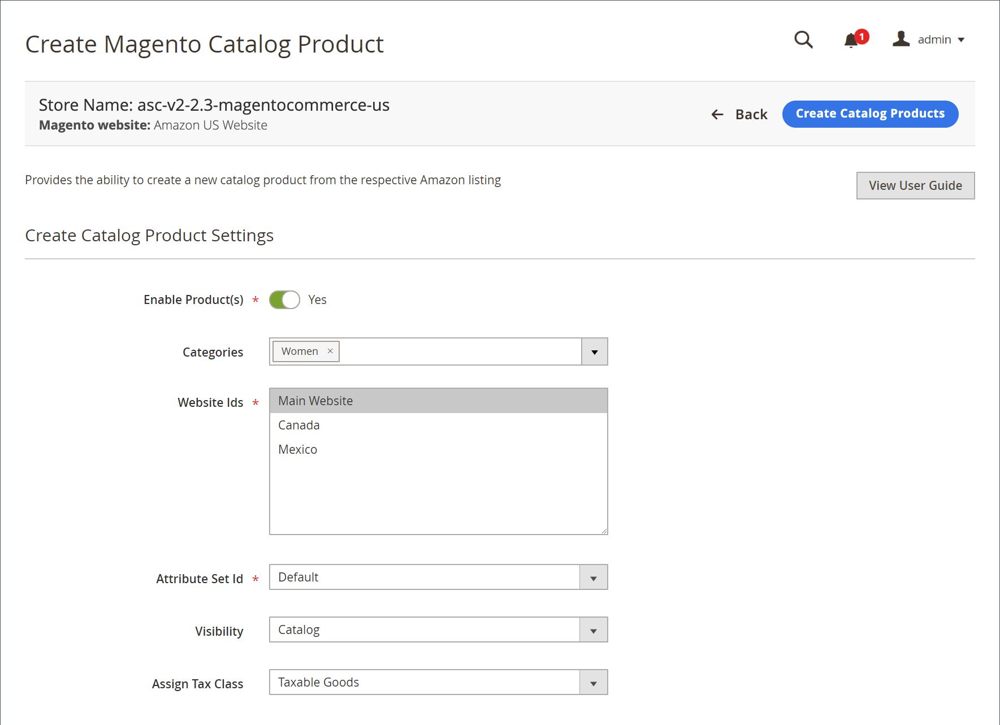

# Producten maken en toewijzen

Bij weergave _[!UICONTROL New Third Party]_kunt u [!DNL Commerce] catalogiseer producten naar een bestaande Amazon-aanbieding. Er zijn twee opties voor deze overeenkomst. U kunt een aanbieding aan een bestaand catalogusproduct toewijzen of u kunt de informatie uit de aanbieding gebruiken om catalogusproducten te maken. Deze opties zijn handig als je Amazon-aanbiedingen niet automatisch overeenkomen met je [!DNL Commerce] catalogus.

Als je de volledige functieset van het verkoopkanaal van Amazon wilt gebruiken, moet je je producten afstemmen op je Amazon-aanbiedingen.

Wanneer u een catalogusproduct maakt op basis van een Amazon-aanbieding:

- De **ASIN** wordt de [!DNL Commerce] SKU
- De **Naam van productaanbieding** wordt de naam van de cataloguslijst
- De **Prijs** en **Aantal** worden geïmporteerd uit de Amazon-aanbieding

De overige benodigde instellingen worden bepaald door de [!DNL Commerce] productinstellingen die u selecteert tijdens het maken.

Wanneer ze zijn gemaakt en gevonden, worden de aanbiedingen verwijderd uit de _[!UICONTROL New Third Party]_en worden weergegeven op het tabblad_[!UICONTROL Active]_ tab.

## Eén catalogusproduct toewijzen aan een Amazon-aanbieding

1. Je productaanbiedingen weergeven op de [_[!UICONTROL New Third Party]_](./new-third-party-listings.md) tab.

1. Zoek de aanbieding die u wilt toewijzen in de lijst en klik op **[!UICONTROL Select]** in de _[!UICONTROL Action]_en klik op **[!UICONTROL Assign Catalog Product]**.

   Met deze handeling wordt het dialoogvenster _[!UICONTROL Assign Magento Catalog Product]_pagina.

1. Blader naar de lijst of filterde de lijst met de [besturingselementen voor werkruimte](./workspace-controls.md) en zoek het geschikte catalogusproduct dat overeenkomt met de aanbieding.

1. Wanneer het juiste product in de lijst wordt weergegeven, klikt u op **[!UICONTROL Assign Catalog Product]** in de _[!UICONTROL Action]_kolom.

Je product en aanbieding komen nu overeen. Verkoopkanaal van Amazon kan nu product- en aanbiedingsgegevens delen met Amazon en je aanbieding en de bijbehorende informatie beheren, zoals de prijs van de aanbieding, de verzendprijs, het aantal voorraad/de hoeveelheid, de ordergegevens en status, enzovoort.

## Eén catalogusproduct maken met de Amazon-aanbiedingsgegevens

1. Je productaanbiedingen weergeven op de [_[!UICONTROL New Third Party]_](./new-third-party-listings.md) tab.

1. Zoek de aanbieding die u in uw [!DNL Commerce] catalogus, klik **[!UICONTROL Select]** in de _[!UICONTROL Action]_en klik op **[!UICONTROL Create New Catalog Product]**.

   Met deze handeling wordt het dialoogvenster _[!UICONTROL Create Magento Catalog Product]_pagina.

1. Voltooi de catalogusinstellingen voor het product.

   - Set **[!UICONTROL Enable Product(s)]** schakelen naar `Yes` of `No` (vereist).

      |Ja|Kies of u het product in aanmerking wilt laten komen voor uw [!DNL Commerce] winkelverkoop.| |Nee|Kies of u het product niet in aanmerking wilt laten komen voor uw [!DNL Commerce] winkelverkoop.|

   - Voor **[!UICONTROL Categories]**, een categorie voor het product toewijzen (optioneel).

      Als u de categorie van het product wilt selecteren, klikt u op de pijl omlaag en schakelt u een selectievakje voor de categorie in. Klikken **[!UICONTROL Done]** wanneer gereed.

   - Voor **[!UICONTROL Website Ids]** kiest u de website (winkel) waaraan het product moet worden gekoppeld.

      De opties in deze lijst zijn afhankelijk van uw [!DNL Commerce] [winkelconfiguratie](https://experienceleague.adobe.com/docs/commerce-admin/start/setup/websites-stores-views.html) instellingen.

   - Voor **[!UICONTROL Attribute Set Id]** (vereist), kiest u een optie.

      `Default` is de standaardselectie. De opties in deze lijst zijn afhankelijk van uw [!DNL Commerce] [kenmerksets](https://experienceleague.adobe.com/docs/commerce-admin/catalog/product-attributes/create/attribute-sets.html) u hebt gevormd.

   - Voor **[!UICONTROL Visibility]** kiest u een optie voor het nieuwe product.

      |**[!UICONTROL Not Visible Individually]** (standaard)|Het product wordt niet in je winkelaanbiedingen opgenomen, hoewel het mogelijk beschikbaar is als een variatie op een ander product.| |**[!UICONTROL Catalog]**|Het product wordt weergegeven in uw catalogusaanbiedingen.| |**[!UICONTROL Search]**|Het product is beschikbaar voor zoekacties.| |**[!UICONTROL Catalog and Search]**|Het product is opgenomen in cataloguslijsten en beschikbaar voor zoekacties.|

   - Voor **[!UICONTROL Assign Tax Class]** kiest u een optie voor het product.

      Welke opties in deze lijst worden weergegeven, is afhankelijk van de [belastingklassen](https://experienceleague.adobe.com/docs/commerce-admin/stores-sales/site-store/taxes/tax-class.html) u hebt gevormd.

   - Klik op **[!UICONTROL Create Catalog Products]**.

Het catalogusproduct wordt gemaakt in uw [!DNL Commerce] en toegewezen aan de Amazon-aanbieding waaruit deze is gemaakt. Nu de aanbieding nu overeenkomt met een bestaande Amazon-aanbieding, wordt de aanbieding uit de _[!UICONTROL New Third Party]_en worden weergegeven in het dialoogvenster_[!UICONTROL Active]_ tab.

## Meerdere catalogusproducten maken met hun Amazon-aanbiedingsgegevens

1. Je productaanbiedingen weergeven op de [_[!UICONTROL New Third Party]_](./new-third-party-listings.md) tab.

1. Selecteer de aanbiedingen waarvoor u catalogusproducten wilt maken.

   U kunt afzonderlijke selectievakjes in de linkerkolom selecteren of u kunt op de pijl omlaag in de linkerbovenkolom klikken en **[!UICONTROL Select All]** of **[!UICONTROL Select All on this Page]**.

1. Onder _[!UICONTROL Actions]_, klikt u op **[!UICONTROL Create New Catalog Product(s)]**.

1. Als u het bevestigingsbericht wilt accepteren en het dialoogvenster _[!UICONTROL Create Magento Catalog Product]_pagina, klikt u op **[!UICONTROL OK]**.

1. Voltooi de catalogusinstellingen voor de producten.

   >[!NOTE]
   >Wanneer u catalogusproducten maakt voor meerdere geselecteerde aanbiedingen, worden de ingevoerde productinstellingen toegepast op alle aanbiedingen.

   - Set **[!UICONTROL Enable Product(s)]** schakelen naar `Yes` of `No` (vereist).

      |Ja|Kies of u het product in aanmerking wilt laten komen voor uw [!DNL Commerce] winkelverkoop.| |Nee|Kies of u het product niet in aanmerking wilt laten komen voor uw [!DNL Commerce] winkelverkoop.|

   - Voor **[!UICONTROL Categories]**, een categorie voor het product toewijzen (optioneel).

      Als u de categorie van het product wilt selecteren, klikt u op de pijl omlaag en schakelt u een selectievakje voor de categorie in. Klikken **Gereed** wanneer gereed.

   - Voor **[!UICONTROL Website Ids]** kiest u de website (winkel) waaraan het product moet worden gekoppeld.

      De opties in deze lijst zijn afhankelijk van uw [!DNL Commerce] [winkelconfiguratie](https://experienceleague.adobe.com/docs/commerce-admin/start/setup/websites-stores-views.html) instellingen.

   - Voor **[!UICONTROL Attribute Set Id]** (vereist), kiest u een optie.

      `Default` is de standaardselectie. De opties in deze lijst zijn afhankelijk van uw [!DNL Commerce] [kenmerksets](https://experienceleague.adobe.com/docs/commerce-admin/catalog/product-attributes/create/attribute-sets.html) u hebt gevormd.

   - Voor **[!UICONTROL Visibility]** kiest u een optie voor het nieuwe product.

      |**[!UICONTROL Not Visible Individually]** (standaard)|Het product wordt niet in je winkelaanbiedingen opgenomen, hoewel het mogelijk beschikbaar is als een variatie op een ander product.| |**[!UICONTROL Catalog]**|Het product wordt weergegeven in uw catalogusaanbiedingen.| |**[!UICONTROL Search]**|Het product is beschikbaar voor zoekacties.| |**[!UICONTROL Catalog and Search]**|Het product is opgenomen in cataloguslijsten en beschikbaar voor zoekacties.|

   - Voor **[!UICONTROL Assign Tax Class]** kiest u een optie voor het product.

      Welke opties in deze lijst worden weergegeven, is afhankelijk van de [belastingklassen](https://experienceleague.adobe.com/docs/commerce-admin/stores-sales/site-store/taxes/tax-class.html) u hebt gevormd.

   - Klik op **[!UICONTROL Create Catalog Products]**.

De catalogusproducten worden gemaakt in uw [!DNL Commerce] en toegewezen aan de Amazon-aanbieding waaruit deze is gemaakt. Nu de aanbiedingen overeenkomen met hun respectievelijke Amazon-aanbieding, worden de aanbiedingen verwijderd uit de [_[!UICONTROL New Third Party]_](./new-third-party-listings.md) en worden weergegeven in het dialoogvenster [_[!UICONTROL Active]_](./active-listings.md) tab.

{width="600" zoomable="yes"}

| Veld | Beschrijving |
|--- |--- |
| [!UICONTROL Enable Product(s)] | (Vereist) Indien ingeschakeld, is het product zichtbaar in uw [!DNL Commerce] storefront. Indien uitgeschakeld, wordt het product niet weergegeven in uw [!DNL Commerce] storefront. |
| [!UICONTROL Categories] | U kunt de naam van de categorie voor het nieuwe product invoeren of een categorie selecteren door op de pijl-omlaag te klikken om de opties weer te geven. Welke opties u hebt, is afhankelijk van uw [categorieën](https://experienceleague.adobe.com/docs/commerce-admin/catalog/categories/create/category-create.html) configuratie. |
| [!UICONTROL Website Ids] | (Vereist) Kies de website (winkel) waaraan het product moet worden gekoppeld. Welke opties u hebt, is afhankelijk van uw [!DNL Commerce] [winkelconfiguratie](https://experienceleague.adobe.com/docs/commerce-admin/start/setup/websites-stores-views.html) instellingen |
| Kenmerkset-id | Kies een kenmerkset. De opties hangen van uw gevormd af [!DNL Commerce] [kenmerksets](https://experienceleague.adobe.com/docs/commerce-admin/catalog/product-attributes/create/attribute-sets.html). |
| [!UICONTROL Visibility] | Opties:<ul><li>**[!UICONTROL Not Visible Individually]** - Het product is niet zichtbaar in uw [!DNL Commerce] storefront (meest voor variantproducten).</li><li>**[!UICONTROL Catalog]** - Hiermee krijgt u toegang tot het product via de categorie waaraan het is gekoppeld op de website.</li><li>**Zoeken** - Hiermee kan het product alleen worden gevonden met het zoekprogramma.</li><li>**[!UICONTROL Catalog and Search]** - Hiermee kunt u de producten openen via de categoriestructuur en met het zoekgereedschap.</li></ul> |
| [!UICONTROL Assign Tax Class] | Wijs een belastingklasse aan het nieuwe product toe. De opties hangen van uw gevormd af [belastingklassen](https://experienceleague.adobe.com/docs/commerce-admin/stores-sales/site-store/taxes/tax-class.html). |
