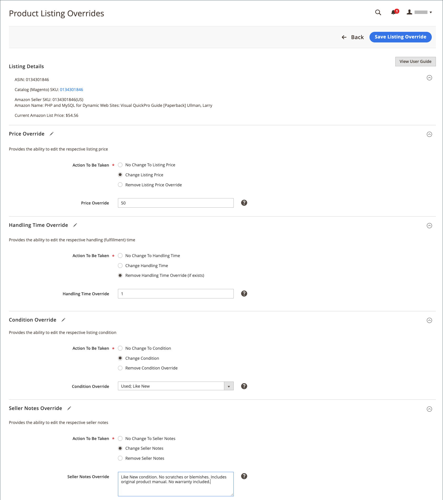

# Overschrijvingen maken en bewerken

U kunt een aanbieding maken en overschrijven of een overschrijving bewerken of verwijderen die op een aanbieding is toegepast. Met Overschrijvingen stelt u een gedefinieerde waarde in voor een bepaalde aanbieding.

## Een overschrijving maken voor één aanbieding

De _[!UICONTROL Create Override]_actie is beschikbaar als je aanbiedingen bekijkt op de_[!UICONTROL Inactive]_, _[!UICONTROL Active]_, en_[!UICONTROL Ineligible]_ tabs.

1. Een aanbieding weergeven op een _[!UICONTROL Products Listings]_pagina (_[!UICONTROL Inactive]_, _[!UICONTROL Active]_, en_[!UICONTROL Ineligible]_ ).

1. In de _[!UICONTROL Action]_kolom, klik **[!UICONTROL Select]**>**[!UICONTROL Create Override]**om de pagina Overschrijvingen van aanbiedingen te openen.

   {width="220"}

1. Controleer de _[!UICONTROL Listing Details]_.

1. Bepaal het type overschrijving dat u maakt.

   Je kunt één overschrijvingstype of een combinatie van typen definiëren voor de aanbieding (Prijs, Verwerkingstijd, Voorwaarde, Opmerkingen van verkoper).

   - **Prijs** - Klik **[!UICONTROL Change Listing Price]** en voer de vastgestelde prijswaarde in voor **[!UICONTROL Price Override]**.
   - **Verwerkingstijd** - Klik **[!UICONTROL Change Handling Time]** en voer de gedefinieerde tijdwaarde (in dagen) in voor **[!UICONTROL Handling Time Override]**.
   - **Voorwaarde** - Klik **[!UICONTROL Change Condition]** en kiest u de juiste optie voor de **[!UICONTROL Condition Override]**.
   - **Opmerkingen van verkoper** - Klik **[!UICONTROL Change Seller Notes]** en voer de tekst van uw notities in voor **[!UICONTROL Seller Notes Override]**.

1. Klik op **[!UICONTROL Save Listing Override]**.

   De _[!UICONTROL Product Listing Overrides]_pagina wordt gesloten. De status van de aanbieding verandert in `Relist in Progress`. De wijziging wordt gepubliceerd naar Amazon met de volgende gegevenssynchronisatie (zoals geconfigureerd in de instellingen voor uitsnijden). De aanbieding wordt ook toegevoegd aan de_[!UICONTROL Overrides]_ tab.

In het volgende voorbeeld wordt een overschrijving getoond die een nieuwe prijs van `$55`, een nieuwe verwerkingstijd van `1 day`, een nieuwe voorwaarde van `Used; Like New`en nieuwe tekst in Opmerking van verkoper.

{width="600" zoomable="yes"}

## Een overschrijving voor één aanbieding bewerken of verwijderen {#edit-override-single-listing}

De _[!UICONTROL Edit Overrides]_actie is beschikbaar als je aanbiedingen bekijkt op de_[!UICONTROL Overrides]_ tab.

1. Een aanbieding weergeven op de _[!UICONTROL Product Listings]_pagina (_[!UICONTROL Overrides]_ ).

1. In de _[!UICONTROL Action]_kolom, klik **[!UICONTROL Select]**>**[!UICONTROL Edit Overrides]**.

   De _[!UICONTROL Product Listing Overrides]_pagina wordt geopend.

   {width="125"}

1. Controleer de _[!UICONTROL Listing Details]_.

1. Als u uw _[!UICONTROL Override]_, definieert u de secties voor het type dat u wilt wijzigen (Prijs, Verwerkingstijd, Voorwaarde, Opmerkingen van verkoper).

   Als u een overschrijvingstype gelijk wilt houden, selecteert u `No Change To <override type>` (de standaardwaarde). Met deze instelling blijft de eerder gedefinieerde overschrijvingswaarde ongewijzigd.

   - **Prijs** - Klik **[!UICONTROL Change Listing Price]** en voer de vastgestelde prijswaarde in voor **[!UICONTROL Price Override]**.
   - **Verwerkingstijd** - Klik **[!UICONTROL Change Handling Time]** en voer de gedefinieerde tijdwaarde (in dagen) in voor **[!UICONTROL Handling Time Override]**.
   - **Voorwaarde** - Klik **[!UICONTROL Change Condition]** en kies de juiste optie voor **[!UICONTROL Condition Override]**.
   - **Opmerkingen van verkoper** - Klik **[!UICONTROL Change Seller Notes]** en voer de tekst van uw notities in voor **[!UICONTROL Seller Notes Override]**.

1. Als u een overschrijvingstype wilt verwijderen, klikt u op **Verwijderen** voor elk type dat u wilt verwijderen. Als deze niet wordt verwijderd, blijft de eerder gedefinieerde waarde in de overschrijving staan.

1. Klik op **[!UICONTROL Save Listing Override]**.

   De _[!UICONTROL Product Listing Overrides]_pagina wordt gesloten. De status van de aanbieding verandert in `Relist in Progress`. De wijziging wordt gepubliceerd naar Amazon met de volgende gegevenssynchronisatie (zoals geconfigureerd in de instellingen voor uitsnijden). Als de aanbiedingen nog niet zijn vermeld, worden ze ook toegevoegd aan de_[!UICONTROL Overrides]_ tab.

Piggydrager op de _Een overschrijving maken_ voorbeeld. In het volgende voorbeeld wordt een bewerking getoond van de eerder gemaakte overschrijving die een nieuwe prijs van `$50`, verwijdert de handeling Tijd overschrijven en zorgt ervoor dat de vorige voorwaarde en verkopersnotities worden genegeerd.

{width="600" zoomable="yes"}
__

## Een overschrijving voor meerdere aanbiedingen bewerken of verwijderen {#edit-override-multiple-listings}

De _[!UICONTROL Edit Listing Overrides]_actie is beschikbaar op_[!UICONTROL Inactive]_, _[!UICONTROL Active]_,_[!UICONTROL Overrides]_, en _[!UICONTROL Ineligible]_tabs.

>[!NOTE]
>
>Omdat u overschrijvingen voor meerdere aanbiedingen wijzigt, kunt u de opdracht _[!UICONTROL Listing Details]_wordt niet weergegeven zoals bij het wijzigen van één aanbieding.

1. De aanbieding weergeven op een _[!UICONTROL Products Listings]_pagina (_[!UICONTROL Inactive]_, _[!UICONTROL Active]_,_[!UICONTROL Overrides]_, en _[!UICONTROL Ineligible]_).

1. Schakel het selectievakje in de linkerkolom in voor alle aanbiedingen die u wilt wijzigen.

1. Onder _[!UICONTROL Actions]_, klikt u op **[!UICONTROL Edit Listing Overrides]**.

   De _[!UICONTROL Product Listing Overrides]_pagina wordt geopend.

   {width="200"}

1. Als u uw _[!UICONTROL Override]_, definieert u de secties voor het type dat u wilt wijzigen (Prijs, Verwerkingstijd, Voorwaarde, Opmerkingen van verkoper).

   Als u dezelfde instelling wilt behouden, selecteert u `No Change To <override type>` (standaard). Met deze instelling blijft de eerder gedefinieerde overschrijvingswaarde ongewijzigd.

   - **Prijs** - Klik **[!UICONTROL Change Listing Price]** en voer de vastgestelde prijswaarde in voor **[!UICONTROL Price Override]**.
   - **Verwerkingstijd** - Klik **[!UICONTROL Change Handling Time]** en voer de gedefinieerde tijdwaarde (in dagen) in voor **[!UICONTROL Handling Time Override]**.
   - **Voorwaarde** - Klik **[!UICONTROL Change Condition]** en kies de juiste optie voor **[!UICONTROL Condition Override]**.
   - **Opmerkingen van verkoper** - Klik **[!UICONTROL Change Seller Notes]** en voer de tekst van uw notities in voor **[!UICONTROL Seller Notes Override]**.

1. Als u een overschrijvingstype wilt verwijderen, klikt u op **[!UICONTROL Remove]** voor elk type dat u wilt verwijderen. Als deze niet wordt verwijderd, blijft de eerder gedefinieerde waarde in de overschrijving staan.

1. Klik op **[!UICONTROL Save Listing Override]**.

   De _[!UICONTROL Product Listing Overrides]_pagina wordt gesloten. De status van de aanbiedingen verandert in `Relist in Progress`. De wijziging wordt gepubliceerd naar Amazon met de volgende gegevenssynchronisatie (zoals geconfigureerd in de instellingen voor uitsnijden). Als de aanbiedingen nog niet zijn vermeld, worden ze ook toegevoegd aan de_[!UICONTROL Overrides]_ tab.

### Typen overschrijven

| Negeren | Beschrijving |
|-------------------------------------|-------------------------------------------------------------------------------------------------------------------------------------------------------------------------------------------------------------------------------------------------------------------------------------------------------------------------------------------------------------------------------------------------------------------------------------------------------------------------------------------------------------------------------------------------------------------------------------------------------------------------------------------------------------------------------------------------------------------------------------------------|
| [!UICONTROL Price Override] | Een prijsoverschrijving definieert de prijs voor de aanbiedingen. Deze overschrijving heeft voorrang op alle geautomatiseerde instellingen totdat de overschrijving wordt verwijderd.  Kies **[!UICONTROL Change Listing Price]** en voer de nieuwe prijs in voor **[!UICONTROL Price Override]**. |
| [!UICONTROL Handling Time Override] | Met een overschrijvingstijd van de verwerkingstijd wordt de tijd (in dagen) voor het verwerken en verzenden van producten gedefinieerd. Een het behandelen tijdopheffing neemt voorrang over alle geautomatiseerde en standaard behandelingstijdinstellingen tot de opheffing wordt verwijderd.  De waarde in het dialoogvenster _[!UICONTROL Handling Time Override]_is de standaardverwerkingstijd die in uw [aanbiedingsinstellingen](./listing-settings.md) of de door u gedefinieerde verwerkingstijd voor overschrijven. Als je een overschrijving van de afhandelingstijd verwijdert, wordt de aanbieding standaard afgehandeld volgens de verwerkingstijd die in de aanbiedingsinstellingen is opgegeven.  Als u een overschrijving wilt definiëren, kiest u **[!UICONTROL Change Handling Time]**en voer de nieuwe verwerkingstijd (in dagen) in voor **[!UICONTROL Handling Time Override]**. |
| [!UICONTROL Condition Override] | Als u de aanbiedingsvoorwaarde wilt overschrijven, kiest u **[!UICONTROL Change Condition]** en kies de nieuwe voorwaarde van **Voorwaarde overschrijven**. |
| [!UICONTROL Seller Notes Override] | Voor producten in uw catalogus die zijn gedefinieerd met een andere voorwaarde dan `New`Een verkopersopmerking kan worden toegevoegd om je product en de conditie ervan voor potentiële kopers nader te beschrijven. Je kunt een overschrijving voor je verkopersnotitie invoeren voor een `New` voorwaardenproduct, maar Amazon geeft de notitie niet weer.  Kies **[!UICONTROL Change Seller Notes]** en voert u de nieuwe notitie in voor **[!UICONTROL Seller Notes Override]**. |
