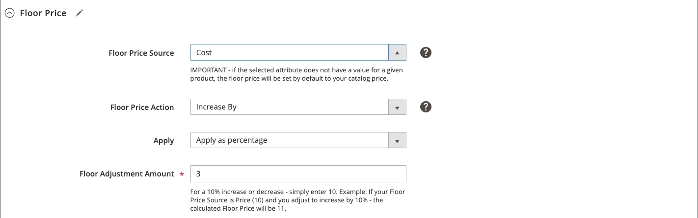

# Intelligente prijsregel: bodemprijs

Secties van een intelligente prijsstellingsregel omvatten:

- [[!UICONTROL Select Rule Type]](./intelligent-repricing-rules.md)
- [[!UICONTROL Competitor Conditional Variances]](./competitor-conditional-variances.md)
- [[!UICONTROL Price Adjustment]](./price-adjustment.md)
- [!UICONTROL Floor Price]
- [[!UICONTROL Optional Ceiling Price]](./optional-ceiling-price.md)

De [onderste prijs](./floor-price.md) montages beschermen automatisch uw laagste productprijs tegen de intelligente prijsregels. Gebruik deze instellingen om een ondergrens (laagste prijs) in te stellen voor uw intelligente prijsregels, zodat uw producten niet onder een gewenste prijs worden weergegeven.

De attributen van de vloerprijs zijn gebaseerd op het websitewerkingsgebied als uw [!DNL Commerce] opslag website het prijswerkingsgebied gebruikt. Zie [Prijsbereik](./price-scope.md).

De vloerprijs wordt slechts gebruikt wanneer **[!UICONTROL Rule Type]** aan `Intelligent repricing rule` wordt geplaatst.

## Minimumprijs configureren

Definieer de laagste prijsinstelling in de sectie _[!UICONTROL Floor Price]_.

1. Kies voor **[!UICONTROL Floor Price Source]** een kenmerk van een prijsbron.

   Kies [!DNL Commerce] [productkenmerk](https://docs.magento.com/user-guide/catalog/product-attributes.html){target=&quot;_blank&quot;} dat op uw relatieve vloedlimiet wijst. Als je bijvoorbeeld niet wilt dat de prijs van je Amazon-aanbieding onder de kostprijs van je object ligt, kies je het kenmerk *Kosten*.

1. Kies voor **[!UICONTROL Floor Price Action]** een optie.

   - `Decrease By` - Kies wanneer u de gedefinieerde  _[!UICONTROL Floor Price Source]_waarde wilt aanpassen, zodat een lagere bodemprijs voor de regel wordt verkregen, voordat u deze aanbiedt aan Amazon.

   - `Increase By` - Kies wanneer u de gedefinieerde  _[!UICONTROL Floor Price Source]_waarde wilt aanpassen, zodat de onderste prijs voor de regel hoger wordt, voordat u de regel aanbiedt aan Amazon.

   - `Match` - Kies wanneer je de prijs van de aanbieding niet onder de gedefinieerde  _[!UICONTROL Floor Price Source]_waarde wilt laten schommelen. Wanneer ingesteld op `Match`, worden de velden_[!UICONTROL Apply]_ en _[!UICONTROL Floor Adjustment Amount]_uitgeschakeld.

1. Laat **[!UICONTROL Apply]** standaard als `Apply as percentage` staan.

1. Voer bij **[!UICONTROL Floor Adjustment Price]** de numerieke waarde voor het percentage in om de waarde _[!UICONTROL Floor Price Source]_aan te passen.

In dit voorbeeld is de laagste prijs ingesteld op 3% boven de prijs van het object.

| Veld | Beschrijving |
|--- |--- |
| [!UICONTROL Floor Price Source] | Kies het [!DNL Commerce] attribuut dat op uw relatieve vloergrens (laagste prijs) wijst. Als je bijvoorbeeld niet wilt dat de prijs van je Amazon-aanbieding onder de kostprijs van je object ligt, kies je het kenmerk `Cost`. |
| [!UICONTROL Floor Price Action] | Kies een handeling voor het aanpassen van de prijzen. Opties:<ul><li>**[!UICONTROL Decrease By]** - Kies wanneer u de gedefinieerde  _[!UICONTROL Floor Price Source]_waarde wilt aanpassen, zodat een lagere bodemprijs voor de regel wordt verkregen, voordat u deze aanbiedt aan Amazon.</li><li>**[!UICONTROL Increase By]** - Kies wanneer u de gedefinieerde  _[!UICONTROL Floor Price Source]_waarde wilt aanpassen, zodat de onderste prijs voor de regel hoger wordt, voordat u de regel aanbiedt aan Amazon.</li><li>**[!UICONTROL Match]** - Kies wanneer je de prijs van de aanbieding niet onder de gedefinieerde  _[!UICONTROL Floor Price Source]_waarde wilt laten schommelen. Wanneer u deze optie kiest, worden de velden_[!UICONTROL Apply]_ en _[!UICONTROL Floor Adjustment Amount]_uitgeschakeld.</li></ul> |
| [!UICONTROL Apply] | **[!UICONTROL Apply as percentage]** - Een percentageaanpassing ten opzichte van de  _[!UICONTROL Floor Price Source]_waarde. |
| [!UICONTROL Floor Adjustment Amount] | Voer de numerieke waarde voor het percentage in om de waarde _[!UICONTROL Floor Price Source]_aan te passen. |
