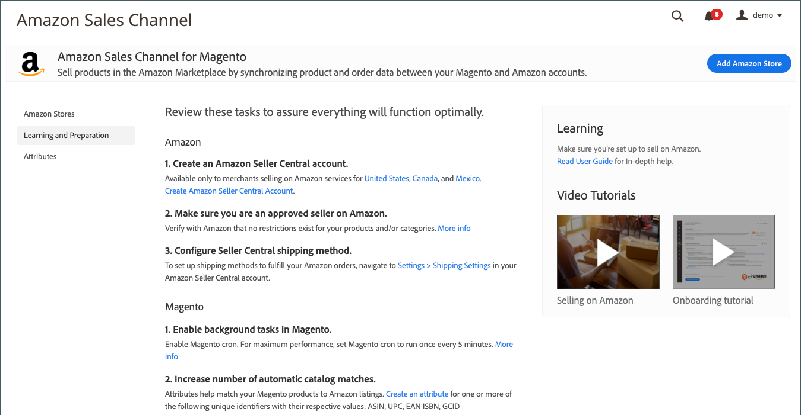

# [!UICONTROL Learning and Preparation]

De _[!UICONTROL Learning and Preparation]_wordt de lijst met vooraf ingestelde taken weergegeven die u kunt aanbevolen voor de integratie van uw Amazon-winkels. Het biedt ook koppelingen naar leermaterialen, zoals:

- Dit [gebruikershandleiding](./overview.md)
- Videozelfstudies

{width="600" zoomable="yes"}
