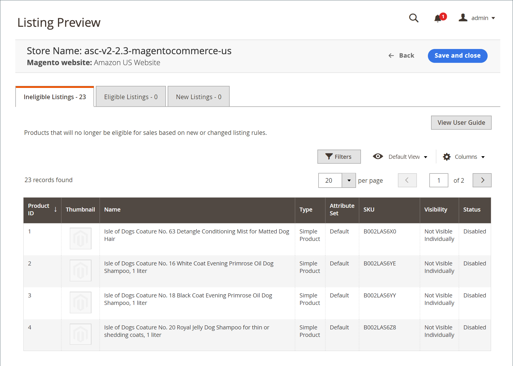

# Aanbiedingsregels

U kunt tot de lijstregels voor opslag in [opslagdashboard](./amazon-store-dashboard.md) toegang hebben.

De aanbiedingsregels bepalen de regels om te bepalen welke producten Amazon verkoopt aan Amazon. Deze regels bieden veel mogelijkheden om eenvoudige tot complexe regels te maken om producten als aanbiedingen op te nemen of uit te sluiten. Elke regel bestaat uit voorwaarden die de voorwaarden bepalen waaraan producten moeten voldoen om in aanmerking te komen voor een productlijst.

Je aanbiedingsregels worden voortdurend gesynchroniseerd met je catalogus [!DNL Commerce]. Als je nieuwe [!DNL Commerce] producten toevoegt die voldoen aan de voorwaarden om in aanmerking te komen voor je aanbieding, worden de producten automatisch verwerkt voor aanbieding op Amazon.

- Als je alle producten naar een Amazon-aanbieding wilt publiceren, moet je geen voorwaarden voor je aanbieding definiëren.

- Als je wilt beperken welke catalogusproducten naar Amazon worden gepubliceerd, definieert je de regelvoorwaarden voor aanbiedingen. Als u de voorwaarden voor uw Amazon-aanbiedingsregels definieert, volgt u dezelfde logica en hetzelfde proces als het definiëren van de voorwaarden voor [Prijsregels voor winkelwagentjes](https://docs.magento.com/user-guide/marketing/price-rules-cart.html){target=&quot;_blank&quot;}.

- Als je aanbiedingsregels een product uitsluiten, verandert de status om in aanmerking te komen voor dat product in `Ineligible`. Niet-subsidiabele producten worden niet gepubliceerd naar Amazon.

- Als een product dat niet in aanmerking komt al op Amazon wordt aangeboden en u de Amazon-aanbieding aanpast aan het catalogusproduct van [!DNL Commerce], verandert de hoeveelheid voor de aanbieding van Amazon in `0` om verkoop van het product te voorkomen. Amazon-aanbiedingen kunnen [handmatig worden verwijderd](./end-listings-manually.md).

Wijzigingen in aantal en geschiktheidsstatus hebben invloed op alle aanbiedingen die de SKU van de verkoper van Amazon delen op markten die bestaan voor winkels die in dezelfde regio verkopen (zoals gedefinieerd in _[!UICONTROL Amazon Marketplace Country]_tijdens [winkelintegratie](./store-integration.md)). Een wijziging in een gedeelde [!DNL Amazon Seller SKU] in één regio heeft echter geen invloed op de Amazon-aanbiedingen van het product in een ander land.

## Instellingen voor aanbiedingsregels configureren

1. Klik **[!UICONTROL Listing Rules]** op het opslagdashboard.

1. Bepaal de voorwaarden die je wilt stellen om in aanmerking te komen voor producten die op Amazon worden aangeboden.

Zie [Voorbeeld: Definieer een voorwaarde](./ob-define-condition-example.md).

| Veld | Beschrijving |
|---|---|
| [!UICONTROL Websites] | Welke opties beschikbaar zijn, is afhankelijk van de [websites](https://docs.magento.com/user-guide/stores/websites-stores-views.html){target=&quot;_blank&quot;} die u hebt ingesteld in uw [!DNL Commerce]-configuratie. Selecteer de website voor de in aanmerking komende producten die op Amazon worden vermeld. Er kan slechts één website worden geselecteerd, omdat voor elke website een unieke Amazon-winkel nodig is die in Amazon-verkoopkanalen is gemaakt. |
| [!UICONTROL Conditions] | Hiermee definieert u de [!DNL Commerce]-kenmerken voor productgeschiktheid in uw Amazon-regio. Zie [Voorbeeld: Definieer een voorwaarde](./ob-define-condition-example.md). |

## Functie Voorwaarden

U kunt op alle gebieden in de voorwaarden die vet zijn, klikken om de verschillende opties weer te geven.

- Voeg geen voorwaarden toe als alle producten binnen de geselecteerde websites in aanmerking komen.
- Er is een complexe reeks back-end processen om direct met Amazon-systemen te communiceren. Op basis van het aantal objecten dat je probeert aan te bieden en de manier waarop het druk is met Amazon-systemen (zoals &#39;Zwarte Vrijdag&#39;), kan het enige tijd duren voordat je objecten op Amazon worden aangeboden.

Voor meer informatie over voorwaarden, zie [beschrijf de Voorwaarden](https://docs.magento.com/user-guide/marketing/price-rules-cart.html){target= &quot;_blank&quot;}.

## Voorvertoning van aanbiedingsregel

Wanneer je de definities van je voorwaarden wijzigt voor je aanbiedingsregels, kun je op **[!UICONTROL Preview Changes]** klikken om de wijzigingen in je regels toe te passen en te bekijken wat de gevolgen zijn voor je aanbiedingen. Verifieer je aanbiedingen in deze voorvertoningsfunctie voordat je wijzigingen in de aanbiedingsregel opslaat.

Je Amazon-aanbiedingen worden vergeleken met je regels en voorwaarden. U kunt dan controleren:

- Welke producten naar een niet-subsidiabele status gaan op basis van uw huidige [!DNL Amazon Seller Central]-account
- Welke producten van een staat die niet in aanmerking komt, naar een in aanmerking komende status worden verplaatst
- Welke producten zijn Nieuwe Amazon-aanbiedingen en worden aan je Amazon-aanbieding toegevoegd vanuit je in aanmerking komende [!DNL Commerce]-producten

Met Voorvertoning van aanbieding kun je je potentiële Amazon-aanbiedingen bekijken en de regels voor aanbiedingen aanpassen.

Je potentiële Amazon-aanbiedingen worden op de pagina _[!UICONTROL Listing Preview]_in een van de volgende drie tabbladen ingevuld:

- **[!UICONTROL Ineligible Listings]** - Aangeboden producten komen niet in aanmerking voor Amazon-aanbieding op basis van de huidige aanbiedingsregels en -voorwaarden.

   Niet-subsidiabele producten worden niet gepubliceerd naar Amazon. Als een product dat niet in aanmerking komt al op Amazon wordt aangeboden en u de Amazon-aanbieding aanpast aan het catalogusproduct van [!DNL Commerce], verandert de hoeveelheid voor de aanbieding van Amazon in `0` om verkoop van het product te voorkomen. Als u een aanbieding handmatig wilt verwijderen, raadpleegt u [Een Amazon-aanbieding beëindigen](./end-listings-manually.md). Producten die niet in aanmerking komen voor Amazon-vereisten worden hier niet vermeld. Deze producten worden vermeld op het [tabblad Niet-actieve aanbiedingen](./inactive-listings.md).

- **[!UICONTROL Eligible Listings]** - Aangeboden producten komen in aanmerking voor Amazon-aanbieding op basis van de huidige aanbiedingsregels en -voorwaarden en komen ook in aanmerking voor Amazon-vereisten. Deze lijst bevat de bestaande Amazon-aanbiedingen die worden geïmporteerd (als u **Aanbiedingen van derden importeren** hebt ingesteld op `Import Listing` in [Aanbiedingsinstellingen](./third-party-listing-settings.md)).

- **[!UICONTROL New Listings]** - De aangeboden producten bevatten  [!DNL Commerce] catalogusproducten die nieuw in aanmerking komen voor Amazon-aanbieding op basis van de huidige aanbiedingsregels en -voorwaarden, en nieuwe Amazon-aanbiedingen maken en publiceren.

### Je voorbeeld van een aanbieding bekijken

1. Klik **[!UICONTROL Listing Rules]** op het opslagdashboard.

1. Bekijk of voeg uw [aanbiedingsregels](./listing-rules.md) toe.

1. Wijzig uw [Voorwaarden aanbiedingsregel](./ob-define-condition-example.md).

1. Klik op **[!UICONTROL Preview Changes]**.

1. Bekijk en bevestig je aanbiedingen op de tabbladen _[!UICONTROL Ineligible Listings]_,_[!UICONTROL Eligible Listings]_ en _[!UICONTROL New Listings]_.

1. Klik op **[!UICONTROL Save and close]** als je aanbiedingen aan uw verwachtingen voldoen.

   Als je aanbiedingen niet zoals verwacht worden weergegeven, klik je op **[!UICONTROL Back]** en wijzig je regels en voorwaarden totdat je aanbiedingen aan je verwachtingen voldoen.

### Records met aanbiedingsvoorvertoningen

| Veld | Beschrijving |
|--- |--- |
| [!UICONTROL Product ID] | Het unieke, opeenvolgende aantal dat aan [!DNL Commerce] catalogusproduct wordt toegewezen wanneer het wordt toegevoegd. |
| [!UICONTROL Thumbnail] | Geeft een miniatuur van de hoofdafbeelding van het product weer. |
| [!UICONTROL Name] | De naam van het product, dat in [!DNL Commerce] [productnet](https://docs.magento.com/user-guide/catalog/products.html) {target= &quot;_blank&quot;} wordt beheerd. |
| [!UICONTROL Type] | Het type van product, dat in het [!DNL Commerce] productnet wordt beheerd. |
| [!UICONTROL Attribute Set] | De naam van de kenmerkenreeks die als malplaatje voor het product wordt gebruikt, in het [!DNL Commerce] productnet wordt beheerd. |
| [!UICONTROL SKU] | De unieke Stock Keeping Unit die aan het product wordt toegewezen, die in het [!DNL Commerce] productnet wordt beheerd. |
| [!UICONTROL Visibility] | Geeft aan waar het product zichtbaar is en wordt beheerd in het productraster [!DNL Commerce]. Opties:<ul><li>`Not visible individually`</li><li>`Catalog`</li><li>`Search`</li><li>`Catalog, Search`</li></ul> |
| Status | Geeft de status van het product aan, beheerd in het productraster [!DNL Commerce]. Opties: `Enabled` / `Disabled` |

