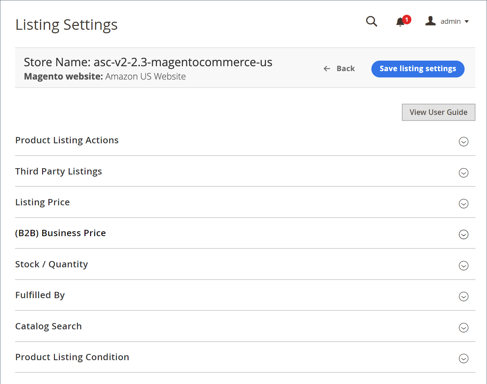

# Aanbiedingsinstellingen weergeven

De lijsten van montages worden betreden van het [ opslagdashboard ](./amazon-store-dashboard.md).

Met deze instellingen wordt gedefinieerd hoe uw catalogusproducten van [!DNL Commerce] op Amazon worden weergegeven. Je aanbiedingsinstellingen bestaan uit verschillende rubrieken waarmee je de interacties en communicatie tussen Amazon-verkoopkanalen en je respectievelijke [!DNL Amazon Seller Central] -account kunt definiëren.

Bij het configureren van je aanbiedingsinstellingen bepaalt je enkele functionele basisparameters:

- Bepaal of je in aanmerking komt voor je catalogusproducten van [!DNL Commerce] om automatisch naar Amazon te publiceren als nieuwe aanbiedingen
- Stel je Amazon-aanbiedingsprijzen in op basis van je catalogus van [!DNL Commerce] of op basis van prijzen voor concurrenten
- De uitvoeringsmethode definiëren

Breid elk van de secties uit en vorm zonodig.

## Aanbiedingsinstellingen beheren

1. Bekijk het opslag [ dashboard ](./amazon-store-dashboard.md) en klik **[!UICONTROL Listing Settings]** in het linkerzijmenu.

1. Vouw elke sectie uit om je aanbiedingsinstellingen te bekijken en te configureren. Vul alle vereiste velden in om door te gaan.

   - [[!UICONTROL Product Listing Actions]](./product-listing-actions.md): definieert of in aanmerking komende [!DNL Commerce] -producten automatisch naar Amazon publiceren en hoe lang de verzending standaard moet duren.
   - [[!UICONTROL Third Party Listings]](./third-party-listing-settings.md): hiermee wordt gedefinieerd of [!DNL Amazon Seller Account] productlijsten moeten worden geïmporteerd in uw [!DNL Commerce] -catalogus.
   - [[!UICONTROL Listing Price]](./listing-price.md): definieer [!DNL Commerce] prijskenmerken en configureer prijsinstellingen.
   - [[!UICONTROL (B2B) Business Price]](./business-pricing.md): Definieer de instellingen voor gedifferentieerde prijzen bij verkoop aan een ander bedrijf.
   - [[!UICONTROL Stock / Quantity]](./stock-quantity.md): Definieer de drempelwaarden voor voorraadbeheer voor voorraadbeheer.
   - [[!UICONTROL Fulfilled By]](./fulfilled-by.md)\: Bepaal wie orden vervult.
   - [[!UICONTROL Catalog Search]](./catalog-search.md): Definieer de zoekparameters voor een betrouwbaar proces voor het afstemmen van uw [!DNL Commerce] -catalogusproducten op uw Amazon-productaanbiedingen.
   - [[!UICONTROL Product Listing Condition]](./product-listing-condition.md): definieer uw instellingen en waarden voor product &quot;condition&quot;. Voorwaarde is een productdetail dat door Amazon wordt vereist, maar niet voor uw catalogusproducten van [!DNL Commerce] wordt vereist.

1. Klik op **[!UICONTROL Save]**.

{width="600" zoomable="yes"}
