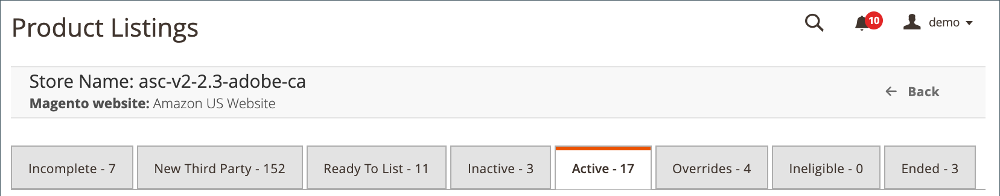

# Aanbiedingen voor Amazon-producten beheren op status/tabblad

De _[!UICONTROL Product Listings]_Deze pagina bevat verschillende tabbladen waarmee je de status van al je aanbiedingen kunt bekijken en je producten kunt afstemmen op aanbiedingen op Amazon.

De beschikbare aanbiedingstaken verschillen enigszins op elk tabblad, maar de [besturingselementen voor werkruimte](./workspace-controls.md) zijn dezelfde en kunt u de gegevens aanpassen die worden weergegeven voor je aanbiedingen.

Opties onder **[!UICONTROL Actions]** kan de handeling op meerdere aanbiedingen toepassen, terwijl opties onder **[!UICONTROL Select]** in de _[!UICONTROL Action]_de handeling alleen op de afzonderlijke aanbieding toepassen.

Zie ook [Aanbiedingen beheren via actie](./managing-listings-by-action.md).

{width="600" zoomable="yes"}

| Tab | Beschrijving | Handelingen |
|--- |--- |--- |
| [[!UICONTROL Incomplete]](./incomplete-listings.md) | Toont uw [!DNL Commerce] catalogusproducten die voldoen aan de door Amazon voor een aanbieding opgegeven aanbiedingsinstellingen, maar die geen gegevens bevatten.  Indien _[!UICONTROL Automatic List Action]_is ingesteld op `Automatically List Eligible Products` in uw [_[!UICONTROL Product Listing Actions]_](./product-listing-actions.md) instellingen, deze items zijn uw **[!UICONTROL In Progress Listings]**. | [!UICONTROL Reattempt auto match to Amazon Listing] [[!UICONTROL Update Required Info]](./amazon-manually-update-incomplete-listing.md) [[!UICONTROL View Details]](./product-listing-details.md) |
| [[!UICONTROL New Third Party]](./new-third-party-listings.md) | Toont je bestaande Amazon-aanbiedingen (op basis van informatie die je van Amazon hebt ontvangen) die niet overeenkomen met een product in je [!DNL Commerce] catalogus. | [[!UICONTROL Create New Catalog Product(s)]](./creating-assigning-catalog-products.md) Automatisch afstemmen proberen [[!UICONTROL Assign Catalog Product]](./creating-assigning-catalog-products.md) [[!UICONTROL Create New Catalog Product]](./creating-assigning-catalog-products.md) [[!UICONTROL View Details]](./product-listing-details.md) |
| [[!UICONTROL Ready to List]](./ready-to-list.md) | Hiermee worden uw catalogusproducten weergegeven die klaar zijn om Amazon-aanbiedingen te maken, maar in je winkel worden nieuwe aanbiedingen niet automatisch gepubliceerd. Dit tabblad wordt gebruikt om nieuwe aanbiedingen handmatig te publiceren.  Indien _[!UICONTROL Automatic List Action]_is ingesteld op `Do Not Automatically List Eligible Products` in uw [_[!UICONTROL Product Listing Actions]_](./product-listing-actions.md) instellingen, deze items zijn uw **[!UICONTROL In Progress Listings]**. | [[!UICONTROL Publish Product to Amazon]](./publish-listings-manually.md) [[!UICONTROL Publish On Amazon]](./publish-listings-manually.md) [[!UICONTROL View Details]](./product-listing-details.md) |
| [[!UICONTROL Inactive]](./inactive-listings.md) | Hiermee worden uw catalogusproducten weergegeven die naar Amazon zijn gepubliceerd, maar Amazon heeft de aanbieding voor de status Actief niet goedgekeurd. | [Einde Aanbieding(en) op Amazon](./end-listings-manually.md) [[!UICONTROL Edit Listing Overrides]](./creating-editing-overrides.md) [[!UICONTROL View Details]](./product-listing-details.md) [[!UICONTROL Create Override]](./creating-editing-overrides.md) [[!UICONTROL Edit Assigned ASIN]](./edit-assigned-asin.md) [[!UICONTROL Create Alias Seller SKU]](./create-alias-seller-sku.md#region-specific) Overschakelen naar volledig door Amazon/Merchant [[!UICONTROL End Listing]](./end-listings-manually.md) |
| [[!UICONTROL Active]](./active-listings.md) | Hiermee worden je Amazon-aanbiedingen getoond die overeenkomen met een product in je [!DNL Commerce] -catalogus, zijn gepubliceerd naar Amazon en zijn ontvangen door Amazon als status Actief. | [[!UICONTROL End Listing(s) on Amazon]](./end-listings-manually.md) [[!UICONTROL Edit Listing Overrides]](./creating-editing-overrides.md) [[!UICONTROL View Details]](./product-listing-details.md) [[!UICONTROL Create Override]](./creating-editing-overrides.md) [[!UICONTROL Edit Assigned ASIN]](./edit-assigned-asin.md) [[!UICONTROL Create Alias Seller SKU]](./create-alias-seller-sku.md#region-specific) Overschakelen naar volledig door Amazon/Merchant [[!UICONTROL End Listing]](./end-listings-manually.md) |
| [[!UICONTROL Overrides]](./overrides.md) | Hiermee worden je Amazon-aanbiedingen weergegeven die voldoen aan de criteria voor een gedefinieerde overschrijving en waarop de overschrijving is toegepast. Overschrijvingen hebben voorrang op andere accountinstellingen. | [[!UICONTROL Edit Listing Overrides]](./creating-editing-overrides.md) [[!UICONTROL Edit Overrides]](./creating-editing-overrides.md) [[!UICONTROL View Details]](./product-listing-details.md) |
| [[!UICONTROL Ineligible]](./ineligible-listings.md) | Bestaande Amazon-aanbiedingen die niet meer in aanmerking komen, worden weergegeven op basis van de door jou gedefinieerde [aanbiedingsinstellingen](./listing-settings.md). | [[!UICONTROL End Listing(s) on Amazon]](./end-listings-manually.md) [[!UICONTROL Edit Listing Overrides]](./creating-editing-overrides.md) [[!UICONTROL View Details]](./product-listing-details.md) [[!UICONTROL Create Override]](./creating-editing-overrides.md) [[!UICONTROL Edit Assigned ASIN]](./edit-assigned-asin.md) [[!UICONTROL Create Alias Seller SKU]](./create-alias-seller-sku.md#region-specific) Overschakelen naar volledig door Amazon/Merchant [[!UICONTROL End Listing]](./end-listings-manually.md) |
| [[!UICONTROL Ended]](./ended-listings.md) | Hiermee worden je Amazon-aanbiedingen weergegeven die handmatig uit Amazon zijn beëindigd (verwijderd). | [[!UICONTROL Publish Product to Amazon]](./publish-listings-manually.md) [[!UICONTROL View Details]](./product-listing-details.md) [[!UICONTROL Publish On Amazon]](./publish-listings-manually.md) [[!UICONTROL Create Alias Seller SKU]](./create-alias-seller-sku.md#region-specific) |

## Productlijsten openen

1. Op de _Beheer_ zijbalk, ga naar **[!UICONTROL Marketing]** > _[!UICONTROL Channels]_>**[!UICONTROL Amazon Sales Channel]**.

1. Klikken **[!UICONTROL View Store]** op de winkelkaart.

1. Klik op het opslagdashboard op **[!UICONTROL Manage Listings]** in de _[!UICONTROL Store Listings]_sectie.
