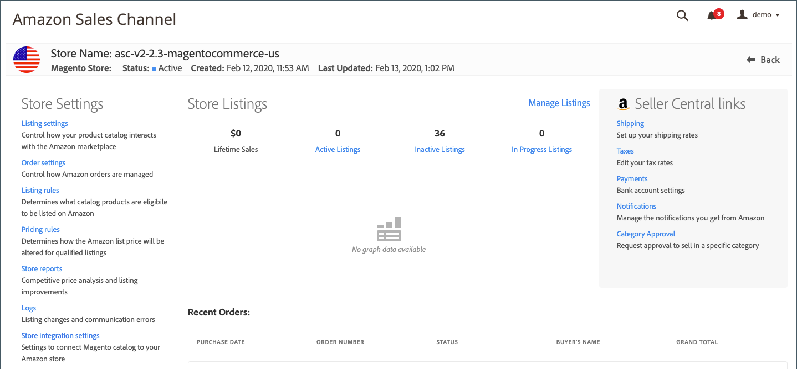

# Winkelinstellingen voor Amazon-verkoopkanaal bekijken

Nadat u de Amazon-winkel voor verkoopkanalen hebt gemaakt en geïntegreerd, controleert u de standaardinstellingen van uw winkel om te controleren of uw product, aanbieding, prijs en andere instellingen correct zijn.

1. Op de _Beheer_ zijbalk, ga naar **[!UICONTROL Marketing]** > _[!UICONTROL Channels]_>**[!UICONTROL Amazon Sales Channel]**.

1. Selecteer de winkel die u wilt weergeven en klik op **[!UICONTROL View Store]**.

1. Klik op het opslagdashboard op een opslaginstelling in het menu aan de linkerkant.

   - [**[!UICONTROL Listing settings]**](./listing-settings.md) - Bepaal hoe uw productcatalogus met de [!DNL Amazon Marketplace].
   - [**[!UICONTROL Order settings]**](./order-settings.md) - Bepalen hoe Amazon-orders worden beheerd.
   - [**[!UICONTROL Listing rules]**](./listing-rules.md) - Bepaal welke catalogusproducten in aanmerking komen om op Amazon te worden vermeld.
   - [**[!UICONTROL Pricing rules]**](./pricing-products.md) - Bepaal hoe de Amazon-catalogusprijs wordt gewijzigd voor aanbiedingen die hiervoor in aanmerking komen.
   - **[!UICONTROL Store reports]** - [Concurrentieprijsanalyse](./competitive-price-analysis.md) en [aanbiedingsverbeteringen](./listing-improvements.md).
   - **[!UICONTROL Logs]** - [Aanbiedingswijzigingen](./listing-changes-log.md) en [communicatiefouten](./communication-errors-log.md).
   - [**[!UICONTROL Store integration setting]s **](./store-integration-settings.md)- Geef de instellingen voor de naam van e-mail- en Amazon-verkoopkanalen weer in de [!DNL Commerce] Admin.

{width="600" zoomable="yes"}
