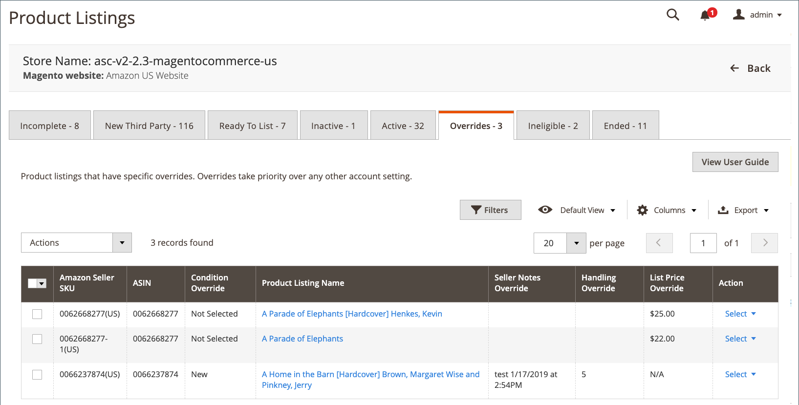

# [!UICONTROL Overrides]

Op het tabblad _[!UICONTROL Overrides]_worden de Amazon-aanbiedingen weergegeven waarop u een overschrijving hebt toegepast. Een overschrijving is een specifieke instelling voor lijsten die u kunt gebruiken om een gedefinieerde waarde in te stellen op een aanbieding. Een overschrijving die wordt toegepast op een aanbieding, definieert de instelling voor de aanbieding, ongeacht andere gedefinieerde aanbiedingsinstellingen of regels waarvoor de aanbieding in aanmerking komt. Wanneer een overschrijving wordt toegepast op een lijst, wordt de vermelding weergegeven op het tabblad_[!UICONTROL Overrides]_ . De waarde die in de overschrijving is gedefinieerd, wordt in de desbetreffende kolom voor de lijst weergegeven. Er zijn vier typen overschrijvingen die kunnen worden toegepast: Prijs, Verwerkingstijd, Voorwaarde en Opmerkingen van verkopers.

## Typen overschrijvingen

| Type | Beschrijving |
|---------------|----------------------------------------------------------------------------------------------------------------------------------------------------------------------------------------------------------------------------------------------------------------------------------------------------------------------------------------------------------------------------------------------------------------------------------------------------------------------------------------------------------------------------------------------------------------------------------------------------------------------------------------------------------------------------------------------------------------------------------------------------------------------------------------------------------------------------------------------------------------------------------------------------------------------------------------------------------------------------------------------------------------------------------|
| Prijs | Een overschrijving waarmee de prijs van de aanbieding wordt ingesteld, waarbij alle andere prijsinstellingen voor de aanbieding worden genegeerd.   **Voorbeeld**: U hebt een regel van de disconteringsprijs bepaald die op alle producten in een specifieke categorie van uw catalogus van toepassing is. Je hebt een nieuw product op de markt en de vraag is hoog. Daarom wil je niet dat de verlaagde prijs op de aanbieding wordt toegepast, ook al valt het product in die categorie. U kunt de lijst selecteren, [ tot een prijsopheffing ](./creating-editing-overrides.md#edit-override-single-listing) leiden, en de lijstprijs in een prijsopheffing bepalen. |
| Verwerkingstijd | Een overschrijving waarmee de verwerkingstijd voor een aanbieding wordt ingesteld, waarbij de standaardverwerkingstijd die in de aanbiedingsinstellingen is ingesteld, wordt genegeerd.  **Voorbeeld**: Uw standaardbehandelingstijd voor uw aanbiedingen wordt geplaatst aan 2 dagen. Je hebt een product dat kwetsbaar is en een extra dag nodig heeft om de speciale verpakking voor de verzending te garanderen. U kunt de lijst bekijken, [ creeert een behandelingstijd met voeten treedt ](./creating-editing-overrides.md#edit-override-single-listing), en bepaalt de behandelingstijd op drie dagen.  **Nota:** niet beschikbaar voor producten die aan `Fulfilled by Amazon` worden geplaatst. |
| Voorwaarde | Een overschrijving waarmee de voorwaardenwaarde van een lijst wordt ingesteld, ongeacht het voorwaardelement dat aan de lijst is toegewezen.  **Voorbeeld**: De meeste producten in uw catalogus zijn Nieuwe voorwaarde, maar u hebt een product dat in Gereviseerde voorwaarde is. U kunt de lijst bekijken, [ creeer een voorwaardenopheffing ](./creating-editing-overrides.md#edit-override-single-listing), en bepaal de Gereviseerde voorwaarde voor de lijst.  **Nota:** niet beschikbaar voor producten die aan `Fulfilled by Amazon` worden geplaatst. |
| Opmerkingen van verkoper | Een opheffing die de _sectie van de Nota&#39;s van de Verkoper_ van de lijst bepaalt. Dit veld kan worden gebruikt om aanvullende informatie toe te voegen met betrekking tot het product of de toegepaste overschrijving, die doorgaans wordt gebruikt om de conditie van &quot;niet-nieuwe&quot; producten te beschrijven. Tekst in dit veld wordt weergegeven met de vermelding voor de winkels. Opmerkingen van verkopers kunnen niet worden toegevoegd voor een aanbieding met de voorwaardenwaarde `New` .   **Voorbeeld**: U hebt een product dat in `Refurbished` voorwaarde is. Normaal gesproken bevatten producten in deze voorwaarde geen handleidingen of documenten, maar u hebt een andere leverancier voor dit product die een handleiding bevat. U kunt de lijst bekijken, [ creeer een opheffing van de verkopersnota&#39;s ](./creating-editing-overrides.md#edit-override-single-listing), en voeg uw tekstnota toe die aan deze lijst over de handleiding uniek is zodat de klant weet het inbegrepen is.  **Nota**: Als een product een bepaalde voorwaarde van `New` heeft, kunt u een opheffing van verkopersnota&#39;s ingaan, maar Amazon toont geen verkopersnota&#39;s voor een `New` product. |

U kunt tot stand brengen, uitgeven, of een opheffing voor a [ één enkele lijst ](./creating-editing-overrides.md#edit-override-single-listing) verwijderen. Op de tabbladen _[!UICONTROL Inactive]_,_[!UICONTROL Active]_ en _[!UICONTROL Ineligible]_kunt u op **[!UICONTROL Select]**in de kolom_[!UICONTROL Action]_ klikken en **[!UICONTROL Create Override]** kiezen. De handeling _[!UICONTROL Edit Overrides]_is alleen beschikbaar wanneer op het tabblad_[!UICONTROL Overrides]_ een overschrijving is toegepast en wordt weergegeven.

U kunt, een opheffing aan [ veelvoudige lijsten ](./creating-editing-overrides.md#edit-override-multiple-listings) ook creëren uitgeven of verwijderen. Op de tabbladen _[!UICONTROL Inactive]_,_[!UICONTROL Active]_ en _[!UICONTROL Ineligible]_kunt u op **[!UICONTROL Select]**in de kolom_[!UICONTROL Action]_ klikken en **[!UICONTROL Edit Listing Overrides]** kiezen.

Als je een overschrijving verwijdert, weet de aanbieding dat ze de waarden moet gebruiken die door de instellingen en regels van je aanbieding worden gedefinieerd.

Wanneer u een overschrijving definieert, kunt u ook één type overschrijving of een combinatie van de typen invoeren.

Zie [ met voeten treden ](./creating-editing-overrides.md) creëren en uitgeven.

>[!NOTE]
>
>Als je aanbiedingen in behandeling hebt, wordt het aantal aanbiedingen weergegeven in een bericht boven de tabbladen.

{width="600" zoomable="yes"}

Amazon delen de homepages van het verkoopkanaal wat gemeenschappelijke [ werkruimtesecontroles ](./workspace-controls.md) die u toestaan om de gegevens aan te passen die worden getoond.

## Standaardkolommen

| Kolom | Beschrijving |
|------------------------------------|------------------------------------------------------------------------------------------------------------------------------------------------------------------------------------------------------------------------------------------------------------------------------------------------------------------------------------------------------------------------------------------------------------------------------------------------------------------------------------|
| [!UICONTROL Amazon Seller SKU] | De SKU (Stock Keeping Unit) die door Amazon aan een product wordt toegewezen om het product, de opties, de prijs, en de fabrikant te identificeren. |
| [!UICONTROL ASIN] | Een uniek blok van 10 letters en/of cijfers dat items identificeert.   ASIN staat voor de StandaardNummers van de Identificatie van Amazon. Een ASIN is een uniek blok van 10 letters en/of getallen dat items identificeert. Voor boeken, is ASIN het zelfde als het aantal ISBN, maar voor alle andere producten wordt een nieuwe ASIN gecreeerd wanneer het punt aan hun catalogus wordt geupload. Je vindt een artikel in ASIN op de productdetailpagina op Amazon, samen met meer informatie over het object. |
| [!UICONTROL Condition Override] | De nieuwe voorwaarde die in de opheffing wordt bepaald. Als de overschrijving die op de lijst is toegepast geen voorwaardenoverschrijving is, wordt `Not Selected` in deze kolom weergegeven. |
| [!UICONTROL Product Listing Name] | De naam van het product. |
| [!UICONTROL Seller Notes Override] | De nieuwe verkopersnotities die in de overschrijving zijn gedefinieerd. Als de overschrijving die op de lijst is toegepast, niet dit type overschrijving is, is deze kolom leeg. |
| [!UICONTROL Handling Override] | De nieuwe verwerkingstijd die is gedefinieerd in de overschrijving (in dagen). Als de overschrijving die op de lijst is toegepast, geen overschrijving is, is deze kolom leeg. |
| [!UICONTROL List Price Override] | De nieuwe aanbiedingsprijs die in de overschrijving is gedefinieerd. Als de overschrijving die op de aanbieding wordt toegepast geen prijsoverschrijving is, wordt `N/A` in deze kolom weergegeven. |
| [!UICONTROL Action] | Lijst met beschikbare acties die kunnen worden toegepast op een specifieke aanbieding. Als u een actie wilt toepassen, klikt u in de kolom _[!UICONTROL Action]_op **[!UICONTROL Select]**en kiest u een optie:<ul><li>[[!UICONTROL Edit Overrides]](./creating-editing-overrides.md#edit-override-single-listing)</li><li>[[!UICONTROL View Details]](./product-listing-details.md)</li></ul> |
