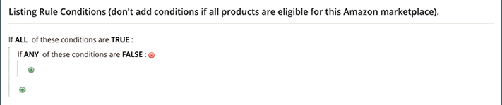

# Voorwaarden voor prijsregels

De voorwaarden bepalen welke producten in aanmerking komen voor de prijsregel. Als u de voorwaarden voor uw prijsregels voor Amazon definieert, volgt u dezelfde logica en hetzelfde proces als het definiëren van de voorwaarden voor [Lijnen met winkelprijzen](https://docs.magento.com/user-guide/marketing/price-rules-cart.html){target="_blank"} in [!DNL Commerce].

>[!IMPORTANT]
>
>Als uw prijsregel van toepassing is op alle producten in uw [!DNL Commerce] en laat deze sectie leeg.

U kunt op alle gebieden in de voorwaarden die vet zijn, klikken om de verschillende opties weer te geven.

## Voorbeeld: een prijsregelvoorwaarde maken

Dit proces kan eenvoudig of gedetailleerd zijn, afhankelijk van uw catalogusconfiguratie. U kunt uw voorwaarden zodanig definiëren dat wanneer `ALL` of `ANY` van de voorwaarden: `TRUE` of `FALSE` voor een product komt het product in aanmerking voor toepassing van de prijsregel.

Voorwaarden zijn gebaseerd op uw [productkenmerken](https://docs.magento.com/user-guide/catalog/product-attributes.html){target="_blank"}. Laat de sectie voor voorwaarden leeg als u de regel op alle producten wilt toepassen.

>[!NOTE]
>
>Als u een voorwaarde wilt bepalen die op een specifiek productattribuut wordt gebaseerd, **Voorwaarden voor promotieregels gebruiken** for the attribute must be set to `Yes` in uw [Eigenschappen van Storefront](https://docs.magento.com/user-guide/stores/attribute-product-create.html){target="_blank"} voor het kenmerk.

In dit voorbeeld wordt een regel gedefinieerd die een korting van 25% toepast op alle producten die in het dialoogvenster `Books` categorie.

De regelinstructie heeft twee vette koppelingen, die, wanneer erop wordt geklikt, de opties voor dat gedeelte van de voorwaardelement weergeven. Als u de voorwaarde opslaat zonder een vette optie te wijzigen, geldt de regel voor al uw producten.

- Klikken **[!UICONTROL ALL]** en kiest u `ALL` of `ANY`.
- Klikken **[!UICONTROL TRUE]** en kiest u een van `TRUE` of `FALSE`.
- Als u de regel op alle producten wilt toepassen, laat u de voorwaarde ongewijzigd.

U kunt verschillende voorwaarden maken door de combinatie van deze waarden te wijzigen. In dit voorbeeld wordt de volgende voorwaarde gebruikt:

`If ALL of these conditions are TRUE:`

1. Klik op Toevoegen () aan het begin van de voorwaardelijn en selecteer een kenmerk waarop u de voorwaarde wilt baseren.

   **[!UICONTROL Conditions Combination]** - Maak een andere set `All/Any` en `True/False` in de bestaande voorwaarde.

   

   **[!UICONTROL Product Attribute]** - De beschikbare productkenmerken zijn afhankelijk van de [instellen van het kenmerk](https://docs.magento.com/user-guide/stores/attribute-product-create.html){target="_blank"}. For an attribute to show in the list, *[!UICONTROL Use for Promo Rule Conditions]* for the attribute must be set to `Yes` in your [storefront properties](https://docs.magento.com/user-guide/stores/attribute-product-create.html){target="_blank"}.

   - Voor **[!UICONTROL Product Attribute]** kiest u het kenmerk dat u wilt definiëren als basis voor de voorwaarde. In dit voorbeeld is de geselecteerde voorwaarde: `Category`.

      

      De geselecteerde voorwaarde wordt weergegeven in de instructie, gevolgd door nog twee vette koppelingen. Welke opties beschikbaar zijn, is afhankelijk van het productkenmerk dat u selecteert.

      Nadat u het kenmerk hebt ingesteld, kunt u het niet meer bewerken. Als u het kenmerk wilt wijzigen, moet u de regel verwijderen en het nieuwe kenmerk toevoegen. U kunt een voorwaardenlijn schrappen door Schrapping te klikken ( aan het einde van de regel.

   - Klikken **[!UICONTROL is]** en kiest u de vergelijkingsoperator die de voorwaarde beschrijft waaraan producten moeten voldoen.

      In dit voorbeeld is de vergelijkingsoperator `is`. De beschikbare opties zijn afhankelijk van het kenmerk dat u in de vorige stap hebt geselecteerd en kunnen verschillende vergelijkingsopties bevatten. Opties kunnen overeenkomende waarden bevatten, met uitzondering van of met inbegrip van ten minste een van een waarde, en groter dan, gelijk aan en kleiner dan een numeriek bedrag. In dit voorbeeld zijn de volgende opties beschikbaar: `is` en `is not`.

   - Klikken **[!UICONTROL ...]** en kiest u de kenmerkwaarde waarop de voorwaarde is gebaseerd. Welke opties beschikbaar zijn, is afhankelijk van de instelling van het kenmerk.

      Mogelijk wordt u gevraagd een optie te selecteren of een waarde voor de voorwaarde in te voeren. In dit voorbeeld wordt het veld leeg weergegeven. Als u de categorie(ën) voor de regel wilt selecteren, klikt u op het pictogram van de kiezer () om de selectieopties weer te geven. Deze regel geldt voor _Boeken_, selecteert u de **[!UICONTROL Books]** selectievakje. Het categorienummer wordt gevuld. Als je rubriekselecties wilt accepteren, klik je op het groene vinkje ().

      

      Het geselecteerde item wordt weergegeven in de instructie om de voorwaarde te voltooien.

      

      Deze voorbeeldvoorwaarde is voltooid. Zoals gezegd betekent deze voorwaarde dat elk product in uw [!DNL Commerce] catalogus met een gedefinieerde categorie Boeken (`4`) komt in aanmerking voor deze prijsregel. U kunt meer voorwaardenlijnen toevoegen om uw in aanmerking komende producten verder te verfijnen.

1. Als u nog een voorwaardelijn aan de instructie wilt toevoegen, gaat u terug naar Stap 1 en herhaalt u het proces totdat alle gewenste voorwaarden zijn voltooid.

   U kunt op elk gewenst moment een regel van de instructie condition verwijderen door op Verwijderen te klikken () aan het einde van de regel.
