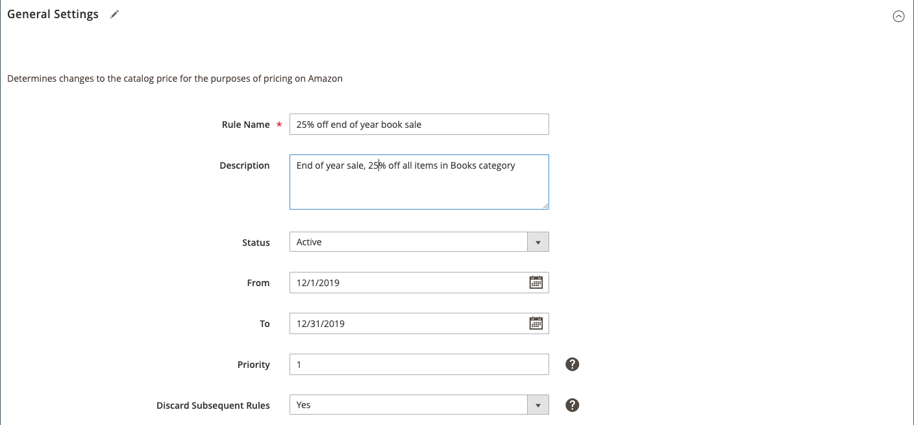

# Algemene instellingen voor prijsregel

Definieer de naam, beschrijving, actieve datums en prioriteit voor de regel.

## Het gedeelte Algemene instellingen van prijsregel invullen

1. Voer bij **[!UICONTROL Rule Name]** (vereist) de naam voor de regel in.

   Deze naam is alleen bedoeld voor uw interne identificatie. Hoe beschrijvender de regelnaam, hoe beter.

1. Voer bij **[!UICONTROL Description]** een gedetailleerde beschrijving van uw regel in.

   Deze beschrijving kan informatie bevatten over de producten die in aanmerking komen, de actieve datums, de formule voor het berekenen van de aangepaste prijs of andere informatie die u nuttig zou vinden als u de regel wilt wijzigen.

1. Kies bij **[!UICONTROL Status]** een optie:

   - `Active` - Kies deze optie als je de prijsregel wilt toepassen op in aanmerking komende producten en je aanbiedingsprijzen wilt aanpassen voordat je deze publiceert naar Amazon.

   - `Inactive` - Kies deze optie als u de prijsregel niet wilt toepassen op in aanmerking komende producten. Deze optie zal zeer waarschijnlijk worden gebruikt wanneer het wijzigen van een prijsregel of het uitzetten van het na een beperkte bevordering.

1. Voer bij **[!UICONTROL From]** en **[!UICONTROL To]** een begin- en einddatum in voor de prijsregel.

   U kunt ook op het kalenderpictogram klikken om een datum in de dynamische kalender te selecteren. Deze automatische start- en stopoptie is nuttig bij het opzetten van promoties in beperkte tijd of seizoensgebonden tijd met een bepaalde begin- en einddatum.

1. Voer bij **[!UICONTROL Priority]** een numerieke waarde in voor de regelprioriteit.

   Prioriteitswaarde gelijk aan `1` is de hoogste prioriteit. Wanneer u veelvoudige actieve het tarief regels hebt, kunt u deze prioritaire waarde gebruiken om te bepalen welke regel eerst wordt toegepast. Dit veld is vereist als u de functie _[!UICONTROL Discard Subsequent Rules]_wilt gebruiken.

1. Kies bij **[!UICONTROL Discard Subsequent Rules]** een optie:

   - `Yes` - Kies deze optie als u geen andere prijsregels wilt toepassen die van toepassing zijn op een product. Als latere regels worden genegeerd, betekent dit dat, wanneer meerdere prijsregels op hetzelfde product van toepassing zijn, alleen de prijsregel met de hoogste gedefinieerde prioriteitswaarde op het product wordt toegepast. Met deze optie wordt voorkomen dat meerdere prijsregels worden gestapeld en onbedoelde extra kortingen bieden.

   - `No` - Kies deze optie als u meerdere prijsregels wilt toepassen op hetzelfde product. Deze optie kan ertoe leiden dat meerdere kortingen worden gestapeld en toegepast.

>[!NOTE]
>
>Om verdere regels te verwerpen, moet een tariferingsregel een bepaalde **Prioriteit** waarde hebben.

{width="600" zoomable="yes"}

| Veld | Beschrijving |
|---------------------------------------|---------------------------------------------------------------------------------------------------------------------------------------------------------------------------------------------------------------------------------------------------------------------------------------------------------------------------------------------------------------------------------------------------------------------------------------------------------------------------------------------------------------------------------------------------------------------------------------------------------------------------------------------------------------------------------------------------------------------------------------------|
| [!UICONTROL Rule Name] | (Vereist) Voer een naam voor de regel in die wordt gebruikt voor interne identificatie. Hoe beschrijvender de regelnaam, hoe beter. Bijvoorbeeld: &quot;25% korting op jaarultimo.&quot; |
| [!UICONTROL Description] | Voer een gedetailleerde beschrijving in die de regel (die ook voor interne doeleinden wordt gebruikt) uitlegt. Bijvoorbeeld: &quot;Verkoop einde jaar, 25% korting op alle objecten in de categorie Boeken.&quot; |
| [!UICONTROL Status] | Opties:<ul><li>**[!UICONTROL Inactive]** - De prijsregel is niet van toepassing op je aanbiedingen. Deze optie kan worden gebruikt wanneer u een prijsregel wijzigt of deze uitschakelt na een beperkte promotie.</li><li>**[!UICONTROL Active]** - De prijsregel geldt voor je aanbiedingen en pas de prijs van je aanbieding aan voordat je op Amazon publiceert.</li></ul> |
| [!UICONTROL From] | Voer de begindatum in waarop de prijsregel begint. Als je bijvoorbeeld een uitverkoop wilt hebben in de laatste maand van het jaar, stel je de `From` datum in op 1 december, zodat de prijsregel automatisch van toepassing is op je Amazon-aanbiedingen die op 1 december beginnen. |
| [!UICONTROL To] | Voer de einddatum in waarop de prijsregel eindigt. Als u het vorige voorbeeld doorloopt en de verkoop wilt beperken tot de laatste maand van het jaar, stelt u de `To` -datum in op 31 december. De prijsregel verloopt dus op 31 december. |
| [!UICONTROL Priority] | Voer een waarde in voor de prioriteit van de prijsregel. Een prioriteitswaarde gelijk aan `1` is de hoogste prioriteit. Wanneer u veelvoudige het tarief regels hebt, kunt u de prioritaire waarde gebruiken om te bepalen welke regel eerst wordt toegepast. Dit gebied wordt vereist om **te gebruiken verwerpt de Volgende eigenschap van Regels**. |
| [!UICONTROL Discard Subsequent Rules] | Gebruikt om veelvoudige het tarief regels toe te staan of te verhinderen en extra kortingen te verstrekken. Als u volgende regels wilt verwijderen, moet voor een prijsregel een waarde zijn gedefinieerd voor **[!UICONTROL Priority]** . Opties:<ul><li>**[!UICONTROL Yes]** - Kies wanneer u geen andere prijsregels wilt toepassen die op een product van toepassing kunnen zijn. Als latere regels worden genegeerd, betekent dit dat wanneer meerdere prijsregels op hetzelfde product van toepassing zijn, alleen de prijsregel met de hoogste gedefinieerde prioritaire waarde wordt toegepast.</li><li>**[!UICONTROL No]** - Kies wanneer u meerdere prijsregels wilt toepassen op hetzelfde product. Deze optie kan ertoe leiden dat er meerdere kortingen op je aanbiedingsprijs worden toegepast.</li></ul> |
