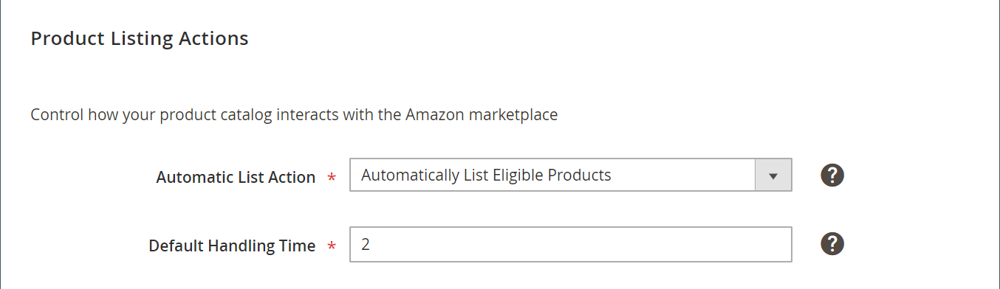

# Handelingen voor productaanbiedingen

De handelingsinstellingen voor productaanbiedingen maken deel uit van de aanbiedingsinstellingen van je winkel. Lijstinstellingen zijn toegankelijk via het [opslagdashboard](./amazon-store-dashboard.md).

Met deze instellingen wordt gedefinieerd hoe uw catalogus reageert op Amazon. Deze instellingen:

- Geef aan of uw [!DNL Commerce] catalogusproducten die voldoen aan de Amazon-voorwaarden automatisch worden verzonden naar uw [!DNL Amazon Seller Central]-account om aanbiedingen te maken.

- Stel de standaardverwerkingstijd voor een bestelling in. Deze waarde definieert het aantal dagen dat u nodig hebt om een bestelling te verwerken en te verzenden. Als iemand bijvoorbeeld 2-dagen verzending selecteert, begint de tijd van de verzending niet voordat de verwerking is voltooid en worden de pakketten aan een vervoerder afgegeven. De totale levertijd is (verwerkingstijd + doorvoertijd + feestdagen).

## Instellingen configureren

1. Klik **[!UICONTROL Listing Settings]** op het opslagdashboard.

1. Vouw de sectie _[!UICONTROL Product Listing Actions]_uit.

1. Kies voor **[!UICONTROL Automatic List Action]** (vereist) een optie:

   - `Automatically List Eligible Products` - (Standaardinstelling) Bepaal wanneer u wilt dat uw  [!DNL Commerce] catalogusproducten (die voldoen aan de Amazon-toelatingsvoorwaarden) automatisch naar Amazon worden gepubliceerd en Amazon-aanbiedingen maken.

   - `Do Not Automatically List Eligible Products` - Kies wanneer u handmatig uw in aanmerking komende  [!DNL Commerce] catalogusproducten wilt selecteren en Amazon-aanbiedingen wilt maken. Als je kiest, worden catalogusproducten die voldoen aan je aanbiedingscriteria en die alle vereiste informatie bevatten, weergegeven op het tabblad [_[!UICONTROL Ready to List]_](./ready-to-list.md) voor handmatige publicatie naar Amazon.

1. Voer voor **[!UICONTROL Default Handling Time]** (vereist) het aantal dagen in dat nodig is voor de doorlooptijd vóór de verzending.

   De standaardwaarde is `2` dagen.

   >[!NOTE]
   >
   >Deze standaardwaarde voor de afhandelingstijd geldt alleen voor Amazon-aanbiedingen die via Amazon-verkoopkanalen zijn gemaakt. Amazon-aanbiedingen die zijn gemaakt in uw [!DNL Amazon Seller Central]-account, gebruiken de standaard verwerkingstijd die is ingesteld in Amazon.

1. Klik op **[!UICONTROL Save listing settings]** als u klaar bent.

| Veld | Beschrijving |
|--- |--- |
| [!UICONTROL Automatic List Action] | Opties:<ul><li>**[!UICONTROL Automatically List Eligible Products]** - (Aanbevolen) Kies wanneer je  [!DNL Commerce] catalogusproducten (die voldoen aan de voorwaarden om in aanmerking te komen voor Amazon) automatisch wilt publiceren naar Amazon en Amazon-aanbiedingen wilt maken. Als u deze optie kiest, wordt de tab [_[!UICONTROL Ready to List]_](./ready-to-list.md) niet weergegeven. </li><li>**[!UICONTROL Do Not Automatically List Eligible Products]** - Kies wanneer u handmatig in aanmerking komende  [!DNL Commerce] catalogusproducten wilt selecteren en Amazon-aanbiedingen wilt maken. Als u een catalogus kiest die voldoet aan de criteria voor je aanbieding en die alle vereiste informatie bevat, worden deze producten op het tabblad [_[!UICONTROL Ready to List]_](./ready-to-list.md) weergegeven voor handmatig publiceren.</li></ul> |
| [!UICONTROL Default Handling Time] | De numerieke waarde die het aantal dagen vertegenwoordigt, in het algemeen, dat het u vergt om uw orden te verwerken en te verzenden. De standaardwaarde is `2`. Deze waarde wordt gebruikt voor Amazon-aanbiedingen die zijn gemaakt in [!DNL Commerce] en gepubliceerd naar Amazon. Deze instelling heeft geen invloed op de standaardverwerkingstijd voor Amazon-aanbiedingen voordat deze worden geïntegreerd met [!DNL Commerce].  De waarde die in het verkoopkanaal van Amazon is gedefinieerd, vervangt de standaardverwerkingstijd die in een bestaande Amazon-aanbieding is gedefinieerd, niet. Wanneer een **[!UICONTROL Handling Time Override]** wordt toegelaten en dan verwijderd, keert de Behandelingstijd voor een orde aan de hier bepaalde waarde terug.  Als u producten hebt die verschillende behandelingstijden hebben, kunt u een Behandelingstijd met voeten treden op het product-specifieke niveau. U kunt overschreven verwerkingstijd beheren op het tabblad [_[!UICONTROL Overrides]_](./overrides.md), zodat u over de flexibiliteit beschikt om de naleving van uw product te beheren. Als een product geen verwerkingstijd overschrijft, is de standaardinstelling voor de verwerkingstijd de waarde die in de Amazon-lijst is gedefinieerd.[!DNL Commerce]  Verwerkingstijd is een regionaal kenmerk. Wanneer de waarde voor een aanbieding wordt gewijzigd, heeft de wijziging invloed op alle aanbiedingen die de [!DNL Amazon Seller SKU] delen in alle Amazon-winkels die voor hetzelfde gebied bestaan (gedefinieerd op [store integration](./store-integration.md)). Het wijzigen van de waarde voor een gedeelde [!DNL Amazon Seller SKU] in de regio Noord-Amerika heeft echter geen invloed op dezelfde producten die zijn opgenomen in een winkel met een ander gedefinieerd gebied. De opslag voor het gebied met de oudste aanmaakdatum bepaalt de prioriteit voor de montages van de Tijd van de Standaardbehandeling. |

**Snelle toegang**  -  [!UICONTROL Listing Settings] secties

- [[!UICONTROL Product Listing Actions]](./product-listing-actions.md)
- [[!UICONTROL Third Party Listings]](./third-party-listing-settings.md)
- [[!UICONTROL Listing Price]](./listing-price.md)
- [[!UICONTROL (B2B) Business Price]](./business-pricing.md)
- [[!UICONTROL Stock / Quantity]](./stock-quantity.md)
- [[!UICONTROL Fulfilled By]](./fulfilled-by.md)
- [[!UICONTROL Catalog Search]](./catalog-search.md)
- [[!UICONTROL Product Listing Condition]](./product-listing-condition.md)
