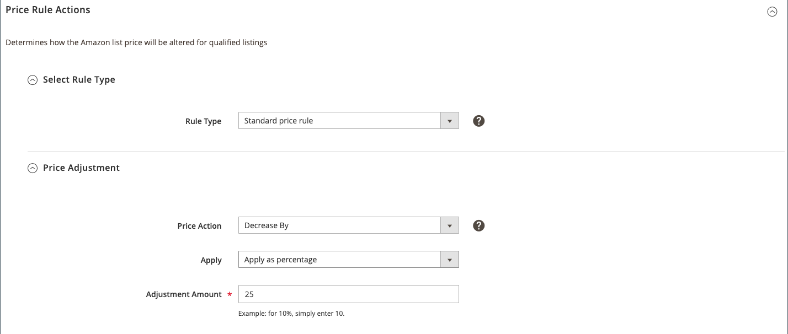

# Standaardprijzenregel

Met een standaardprijsregel kun je een Amazon-prijs verhogen of verlagen met een bepaald percentage of een bepaald bedrag in dollar ten opzichte van de [!DNL Commerce] catalogusprijs (of prijsbron).

De volgende onderdelen van een standaardprijsregel zijn:

- [!UICONTROL Select Rule Type]
- [!UICONTROL Price Adjustment]

## Prijsregelacties configureren

1. Voor **[!UICONTROL Rule Type]** kiest u `Standard price rule`.

   Met deze optie worden de andere velden in het dialoogvenster _[!UICONTROL Select Rule Type]_sectie.

1. Breid uit _[!UICONTROL Price Adjustment]_indien nodig.

1. Voor **[!UICONTROL Price Action]** kiest u een optie om te bepalen hoe u de *[!UICONTROL Magento Price Source]* (gedefinieerd in uw [Aanbiedingsprijs](./listing-price.md)).

   - `Decrease By` - Kies wanneer je de waarde wilt verlagen voordat je een aanbieding naar Amazon maakt.

   - `Increase By` - Kies wanneer je de waarde wilt verhogen voordat je een aanbieding naar Amazon maakt.

1. Voor **[!UICONTROL Apply]** kiest u een optie om te bepalen hoe u de gedefinieerde *[!UICONTROL Magento Price Source]* gedefinieerd in uw [Aanbiedingsprijs](./listing-price.md) aan te passen waarde:

   - `Apply as percentage` - Kies wanneer u de definitie wilt *[!UICONTROL Magento Price Source]* gedefinieerd in uw [Aanbiedingsprijs](./listing-price.md) met een percentage gecorrigeerde waarde

   - `Apply as fixed amount` - Kies wanneer u de definitie wilt *[!UICONTROL Magento Price Source]* gedefinieerd in uw [Aanbiedingsprijs](./listing-price.md) met een vast bedrag gecorrigeerde waarde.

1. Voor **[!UICONTROL Adjustment Amount]** (vereist), de numerieke waarde voor de prijsaanpassing invullen.

   - Wanneer *[!UICONTROL Apply]* is ingesteld op `Apply as percentage`Voer de percentagewaarde in (voorbeeld: enter `25` voor een prijsaanpassing van 25 %).

   - Wanneer *[!UICONTROL Apply]* is ingesteld op `Apply as fixed amount`Voer de numerieke waarde voor het vaste bedrag in (bijvoorbeeld: enter `25` voor een vaste prijsaanpassing van $ 25).

1. Klik op **[!UICONTROL Save pricing rule]**.

{width="600" zoomable="yes"}

| Veld | Beschrijving |
|--------------------------------|-----------------------------------------------------------------------------------------------------------------------------------------------------------------------------------------------------------------------------------------------------------------------------------------------------------------------------------|
| [!UICONTROL Rule Type] | Selecteren `Standard price rule`. |
| [!UICONTROL Price Action] | Opties:<ul><li>**[!UICONTROL Decrease By]** - Kies wanneer u de definitie wilt [!DNL Commerce] de waarde van de prijsbron moet worden verlaagd voordat deze aan Amazon wordt aangeboden.</li><li>**[!UICONTROL Increase By]** - Kies wanneer u de definitie wilt [!DNL Commerce] de waarde van de prijsbron moet worden verhoogd voordat deze aan Amazon wordt aangeboden.</li></ul> |
| [!UICONTROL Apply] | Opties:<ul><li>**[!UICONTROL Apply as percentage]** - Kies wanneer u de definitie wilt [!DNL Commerce] de waarde van de prijsbron gecorrigeerd met een percentage.</li><li>**[!UICONTROL Apply as fixed amount]** - Kies wanneer u de definitie wilt [!DNL Commerce] de waarde van de prijsbron aangepast met een vast bedrag.</li></ul> |
| [!UICONTROL Adjustment Amount] | Vereist.  Als u `Apply as percentage` for *[!UICONTROL Apply]* Voer de percentagewaarde in (voorbeeld: enter `25` voor een aanpassing van 25%).  Als u `Apply as fixed amount` for *[!UICONTROL Apply]* Voer de numerieke waarde voor het vaste bedrag in (bijvoorbeeld: enter `25` voor een vaste correctie van $ 25). |
