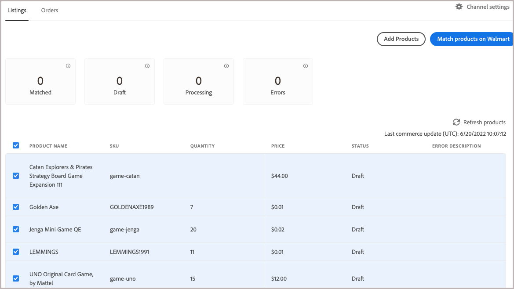

# Producten toevoegen aan [!DNL Channel Manager]

Producten toevoegen aan de [!DNL Walmart Marketplace] verkoopkanaal, selecteer hen van [!DNL Commerce] productcatalogus en importeren naar [!DNL Channel Manager].
Het importeren kan maximaal 30 minuten duren, afhankelijk van het aantal producten dat u selecteert.

## Vereiste

**[Kenmerken van catalogus toewijzen](map-catalog-attributes.md)**—In de [!DNL Channel Settings] configuratie, kaart minstens één attribuut van [!DNL Commerce] productcatalogus naar een van de vereiste Walmart-product-id&#39;s—-GTIN, ISBN, ISSN, UPC, EAN.

## Aanbiedingsvereisten

[!DNL Commerce] productlijsten moeten de volgende vereiste kenmerkconfiguratie hebben:

- **[!UICONTROL Connect to Channel Manager]** attribute is enabled

- Verstrek geldige waarden voor de vereiste attributen van de Mara.

   - Ten minste één productkenmerk dat overeenkomt met een van de vereiste [!DNL Walmart Marketplace] product identifiers-GTIN, ISBN, ISSN, UPC, EAN.

   - Productprijs tot maximaal twee decimalen opgegeven, bijvoorbeeld `9.99`

   - Productgewicht gespecificeerd tot maximaal twee decimalen, bijvoorbeeld `1.25`

>[!TIP]
>
>Voor meer informatie over het optimaliseren van aanbiedingen voor je verkoopkanaal raadpleegt u de [Handleiding voor de optimalisatie van de aanbiedingskwaliteit van Walmart Marketplace](https://marketplace.walmart.com/wp-content/uploads/2020/09/WMP_listing_quality_optimization_guide.pdf).

## Producten toevoegen

1. Selecteer in een online verkoopkanaalwinkel de optie **Producten toevoegen** om de productcatalogus te openen.

   

   De catalogus wordt op een nieuw tabblad geopend.

1. Selecteer in het productraster van de catalogus de producten waarop u wilt verkopen [!DNL Walmart Marketplace].

   

1. De optie **[!UICONTROL Connect to Channel Manager]** voor de geselecteerde items.

   - Van **[!UICONTROL Actions]**, selecteert u **[!UICONTROL Update attributes]**.

   - Naar de **[!UICONTROL Connect to Channel Manager]** en inschakelen.

   - Controleren of de productkenmerken ten minste een van de vereiste kenmerken bevatten [!DNL Walmart Product IDs].

   - Selecteren **[!UICONTROL Save]**.

      Er wordt een bevestigingsbericht weergegeven.

      

      Als het bericht aangeeft dat de update is gepland, gebruikt u de [wachtrij:consumers:start](https://devdocs.magento.com/guides/v2.4/config-guide/cli/config-cli-subcommands-queue.html) [!DNL CLI] gebruiken om de update onmiddellijk te verwerken.

      ```bash
      $ bin/magento queue:consumers:start product_action_attribute.update
      ```

1. Nadat het importeren is voltooid, controleert u de producten die u hebt toegevoegd door terug te keren naar [!DNL Channel Manager] en selecteren **[!UICONTROL Listings]**.

   In eerste instantie bevinden de producten zich in *Concept* status. Selecteren **[!UICONTROL Refresh products]** om de tabel bij te werken.

1. Werk de mening bij om de nieuwe producten te tonen die aan de Manager van het Kanaal worden toegevoegd door te selecteren **[!UICONTROL Draft]** statuskaart.

   


