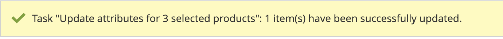

# Producten aan de Kanaalwinkel toevoegen

Selecteer in Kanaalbeheer producten in het menu [!DNL Commerce] catalogus voor de verkoop van Walmart Marketplace.

Om producten aan het verkoopkanaal te synchroniseren, moeten de geselecteerde producten de volgende attributenconfiguratie hebben:

- **[!UICONTROL Publish to Channel Manager]** attribute is enabled

- Ten minste één productkenmerk moet overeenkomen met een van de [vereiste Marketplace-kenmerken voor Marketplace](map-product-attributes-for-matching.md)-GTIN, ISBN, ISSN, UPC, EAN

Nadat u selecties hebt opgeslagen, importeert de Channel Manager de productgegevens naar het kanaal. Dit proces kan tot 30 minuten duren.

## Producten toevoegen aan verkoopkanaal

1. Open de productcatalogus die bij de Channel Manager-winkel hoort.

   Selecteer in een online verkoopkanaalwinkel de optie **Producten toevoegen**.

   

   De catalogus wordt op een nieuw tabblad geopend.

1. Selecteer in het raster van het catalogusproduct de producten die u wilt verkopen op Walmart Marketplace.

   

1. De optie **[!UICONTROL Publish to Channel Manager]** voor de geselecteerde items.

   - Van **[!UICONTROL Actions]**, selecteert u **[!UICONTROL Update attributes]**.

   - Naar de **[!UICONTROL Publish to Channel Manager]** en inschakelen.

   - Verifieer dat de productattributen minstens één van de vereiste Producten IDs van het Marm omvatten.

   - Selecteren **[!UICONTROL Save]**.

   Er wordt een bevestigingsbericht weergegeven.

   

   Als het bericht aangeeft dat de update is gepland, gebruikt u de [wachtrij:consumers:start](https://devdocs.magento.com/guides/v2.4/config-guide/cli/config-cli-subcommands-queue.html) [!DNL CLI] gebruiken om de update onmiddellijk te verwerken.

   ```bash
   $ bin/magento queue:consumers:start product_action_attribute.update
   ```

1. Terug naar het aangesloten verkoopkanaal in [!DNL Channel Manager].

   Nadat het importeren is voltooid, kunt u producten weergeven vanuit **[!UICONTROL Listings]**. In eerste instantie bevinden de producten zich in *Concept* status. Selecteren [!UICONTROL Refresh products]** om de tabel bij te werken.

   
