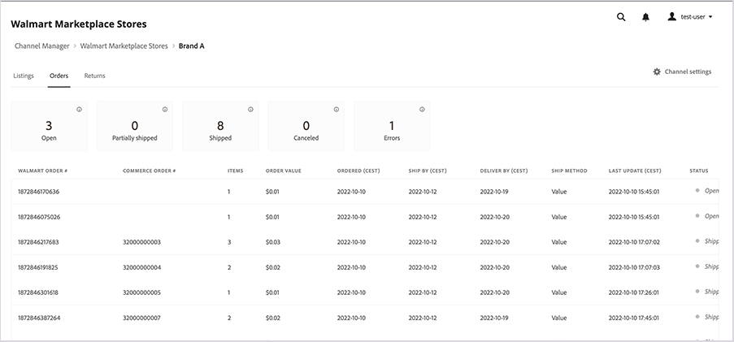

# Walmart Marketplace-bestellingen beheren

[!DNL Walmart Marketplace] orders voor [!DNL Commerce] productaanbiedingen worden automatisch gesynchroniseerd met [!DNL Channel Manager] nadat Walmart de orde verwerkt. Wanneer de synchronisatie is voltooid, kunt u de orderinformatie weergeven door **[!UICONTROL Orders]** vanuit de online-kanaalwinkelweergave in [!DNL Channel Manager].

>[!NOTE]
>
>Het kan tot 35 minuten duren [!DNL Walmart Marketplace] in de [!DNL Channel Manager] orderlijst. [!DNL Walmart] vereist ongeveer 30 minuten om binnenkomende orders te verwerken en naar te sturen [!DNL Channel Manager].  Nadat Channel Manager de bestelling heeft ontvangen, duurt het nog 5 minuten om de bestelling te maken en weer te geven in Adobe Commerce of Magento Open Source.

## Bestellingen controleren

1. Selecteer bij Beheer de optie **[!UICONTROL Marketing]** > **[!UICONTROL Channel Manager]** om de [!UICONTROL Channel Manager Marketplace Stores] pagina.

1. Open de archiefweergave door het potloodpictogram te selecteren in een rij met items in de winkel.

1. Selecteer * om de ordergegevens weer te geven[!UICONTROL *Orders]**.

## Bestelgegevens weergeven

Nadat een bestelling van de markt is ontvangen en in de Adobe Commerce of de Magento Open Source is geïmporteerd, gebruikt u de [!DNL Commerce] Order ID to view the order in Adobe Commerce.

Van **[!UICONTROL Orders]**, selecteert u de [!UICONTROL Commerce Order Number] om de [!DNL Commerce]  orderdetails.

### Besturingselementen voor bestellingen en kolombeschrijvingen

De volgende lijsten beschrijven de controles en de kolommen beschikbaar voor Orden.

**Besturingselementen voor[!UICONTROL Orders]**
| **Control**                    | **Beschrijving**                                                                                                                                               | |—|—| | [!UICONTROL Filter orders]     | U kunt de weergave sorteren door een van de [!UICONTROL Order Status] kaarten.                                                                                        | | Foutberichten | Over de [!UICONTROL Error Status] voor een bestelling om het gedetailleerde foutbericht te zien.                                                                      | | [!UICONTROL View order detail] | Selecteer de optie [!DNL Commerce] ordernummer in het [!UICONTROL Order] tabel. Gebruik vervolgens [!DNL Commerce] bestellen opties om de bestelling te verwerken. |

**Kolombeschrijvingen**

| Veld | Beschrijving |
|------------------------------------|----------------------------------------------------------------------------------------------------------------------------------------------------------------------------------------------------------------------------------------------------------------------------------------------------------------------------------------------------------------------------------|
| [!UICONTROL  Walmart Order Number] | Het inkoopordernummer dat aan de order in het [!DNL Walmart Marketplace]. Wanneer een bestelling voor het eerst wordt geïmporteerd in [!DNL Channel Manager], alleen het Walmart-ordernummer wordt weergegeven. Wanneer de [!DNL Commerce] order wordt gemaakt, de [!DNL Walmart] ordernummer wordt opgeslagen in het dialoogvenster [!UICONTROL External ID] productkenmerk. |
| [!DNL Commerce]  Volgnummer | Het nummer dat aan de [!DNL Commerce]  bestelling gemaakt op basis van de [!DNL Walmart Marketplace] bestelling. |
| Items | Aantal bestelde objecten op [!DNL Walmart Marketplace]. |
| [!UICONTROL Order Value] | Totale kosten van de bestelde objecten. |
| [!UICONTROL Date Created] | De datum waarop de order is gemaakt op de [!DNL Walmart Marketplace]. |
| [!UICONTROL Ship By Date] | Datum waarop de bestelling moet worden verzonden door om te voldoen aan [!DNL Walmart Marketplace] eisen. |
| [!UICONTROL Order Status] | Geeft de huidige orderstatus in het dialoogvenster [!DNL Commerce] bestelworkflow. De status wordt bijgewerkt wanneer u producten toevoegt aan [!DNL Channel Manager] en wanneer u producten op de [!DNL Walmart Marketplace]. Als een bewerking mislukt, wordt de status Fout weergegeven. Nadat u de fout hebt verholpen, [!DNL Channel Manager] probeert de bewerking opnieuw en werkt de status bij. |

### Over Status van bestelling

[!UICONTROL Order Status] bevat informatie over de huidige status van [!DNL Walmart Marketplace] bestellingen beheerd vanuit Adobe Commerce of Magento Open Source. De statusupdates van de orde komen voor wanneer [!DNL Channel Manager] ontvangt bijgewerkte orderinformatie van of [!DNL Walmart Marketplace] of de [!DNL Commerce] bestelsysteem. Orders kunnen de volgende statussen hebben:

* **[!UICONTROL Open]**-Bestellingen ontvangen van de [!DNL Walmart Marketplace] klaar om te worden beoordeeld en verwerkt in Adobe Commerce of Magento Open Source.

   Nadat een klant een product van [!DNL Walmart Marketplace], kan het tot 35 minuten duren voordat de open orde in de ordewerkruimte voor het aangesloten kanaal wordt getoond. [!DNL Commerce] vereist ongeveer 30 minuten om binnenkomende orders te verwerken en naar te sturen [!DNL Channel Manager]. Nadat Channel Manager de bestelling heeft ontvangen, duurt het nog 5 minuten om de [!DNL Commerce] bestelling.

* **[!UICONTROL Processed]**-Bestellingen die zijn verzonden, geannuleerd of terugbetaald uit de [!DNL Commerce] opslaan.

   Als u alle verzonden, geannuleerde en terugbetaalde orders wilt weergeven, selecteert u de optie **Verwerkt** statuskaart.

* **[!UICONTROL Canceled]**-Bestellingen die zijn geannuleerd vanaf de [!DNL Commerce] opslaan.

   Nadat de orderannulering is voltooid, worden de [!DNL Commerce] voorraadhoeveelheid wordt bijgewerkt om geretourneerde objecten weer te geven. Vervolgens [!DNL Channel Manager] synchroniseert de update naar de [!DNL Walmart Marketplace].

* **[!UICONTROL Refunded]**-Bestellingen die zijn terugbetaald uit de [!DNL Commerce] opslaan.

   Nadat de restitutie is voltooid, wordt de [!DNL Commerce] voorraadhoeveelheid wordt bijgewerkt om de terugbetaalde objecten weer te geven. Vervolgens [!DNL Channel Manager] synchroniseert de update naar de [!DNL Walmart Marketplace].

* **[!UICONTROL Error]**- Bestellingen die niet naar de gegevensopslagplaats zijn geïmporteerd vanwege ontbrekende informatie of andere problemen.

   Houd de muisaanwijzer boven de knop *[!UICONTROL Error]* statusindicator. Nadat u de fout hebt opgelost, wordt de volgorde automatisch bijgewerkt om de huidige informatie en status weer te geven.
